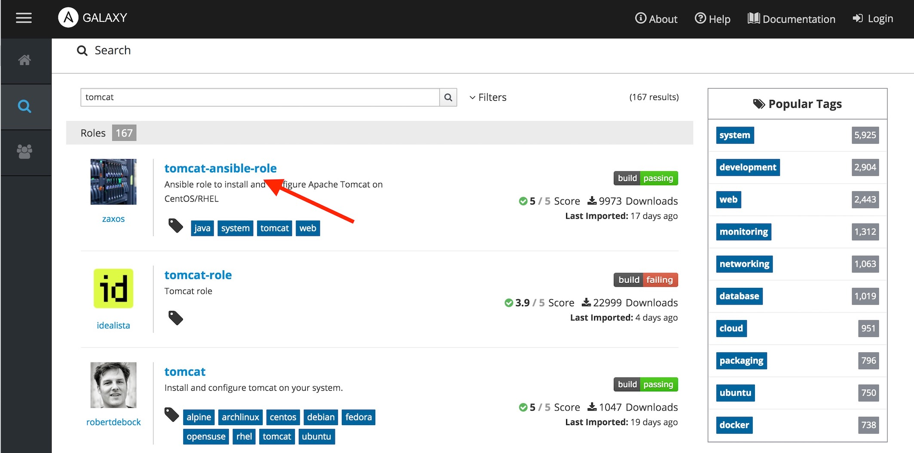
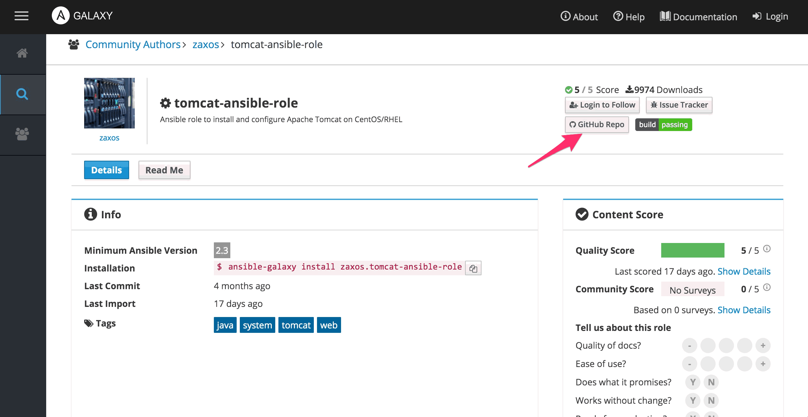
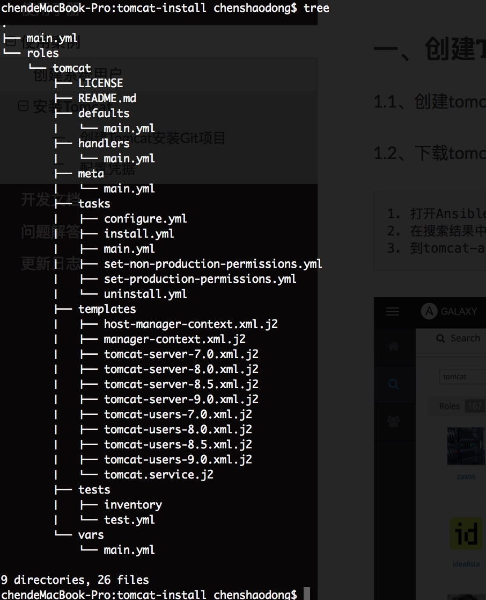
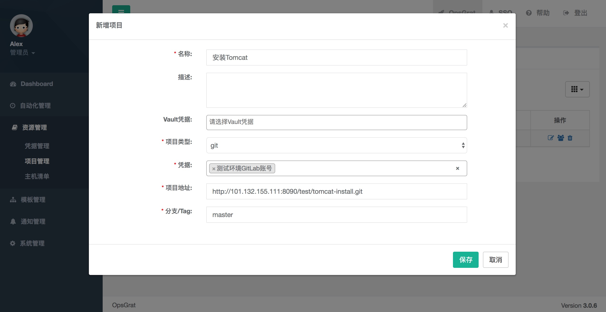
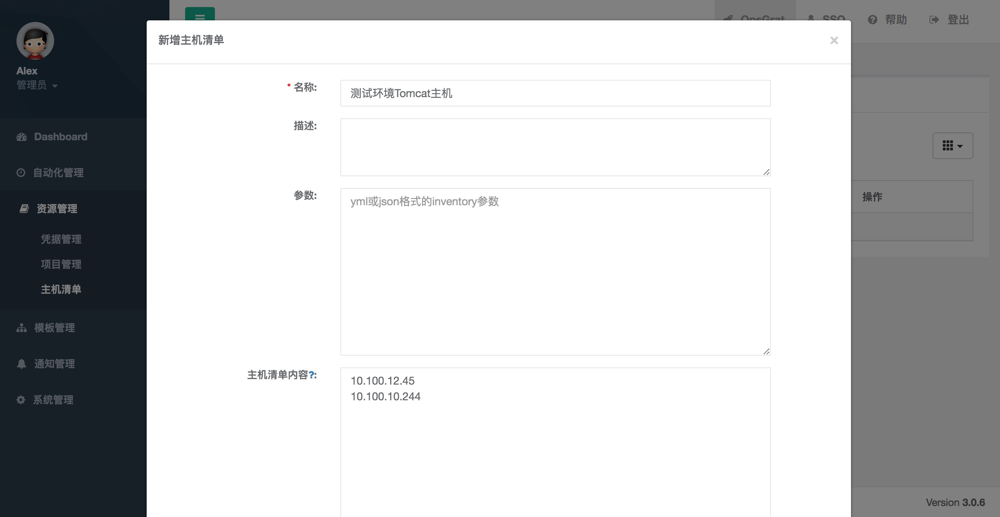
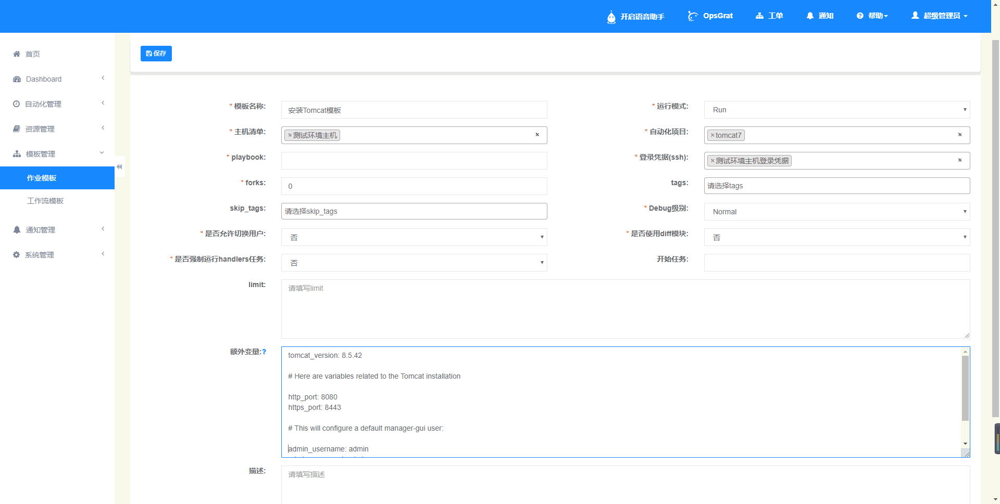
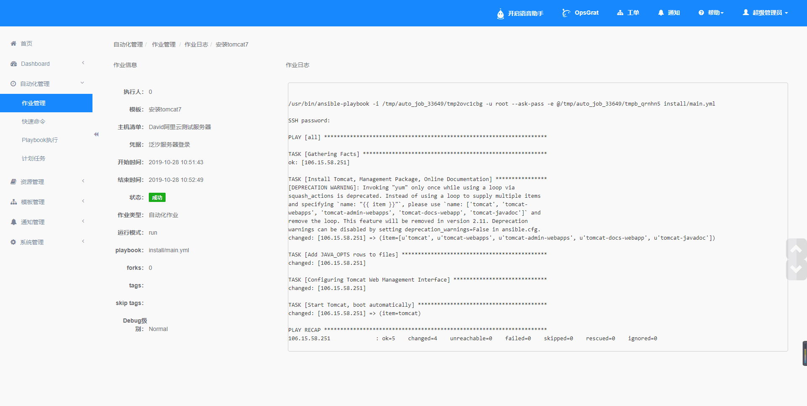

安装Tomcat
=============================

一、创建安装Tomcat playbook
-----------------------------

1.1、创建tomcat-install目录，并在tomcat-install目录中创建roles目录

1.2、下载tomcat roles
::
    1. 打开Ansible Galaxy（https://galaxy.ansible.com）并搜索tomcat
    2. 在搜索结果中点击第一个roles（tomcat-ansible-role）
    3. 到tomcat-ansible-role的github中下载roles

1.3、将下载到的tomcat-ansible-role-master.zip解压到tomcat-install/roles目录中，并改名为tomcat

1.4、进入tomcat-install目录，创建main.yml文件，并添加如下内容
::
   ---
   # Install Tomcat

   - hosts: all
  
     roles:
     - tomcat

     tags:
     - tomcat

1.5、创建好后项目的目录结构如下图所示

1.6、将tomcat-install上传到GitLab中，假设其GitLab仓库地址为：http://10.12.155.111:8090/test/tomcat-install.git

二、配置凭据
----------------------------

- 如果已经配置过主机登录凭据和GitLab凭据则跳过此步骤

2.1、打开OpsGrat，点击左侧“资源管理”菜单下的“凭据管理”，进入凭据管理页面：

.. image:: ../_static/img/example/pingju.png

2.2、添加主机登录凭据，点击新增按钮，“凭据类型”选择“ssh“，添加登录主机的ssh凭据：
::

   ssh凭据可以设置通过用户名密码登录也可以配置通过ssh私钥登录
   本文假设通过用户名密码登录，则填写内容如图所示

.. image:: ../_static/img/example/pingju_ssh.png

2.3、添加GitLab凭据，点击新增按钮，“凭据类型”选择“用户名密码”
::

   GitLab用户密码只支持http的用户密码

.. image:: ../_static/img/example/pingju_gitlab.png

三、添加安装tomcat项目
-----------------------------------

3.1、点击左侧“资源管理”菜单下的“项目管理”菜单，进入项目管理页面：

.. image:: ../_static/img/example/project.png

3.2、添加git项目，点击新增按钮，在新增表单中填写如下内容：
::
   名称：安装Tomcat
   项目类型：选择“git”
   凭据：选择步骤2.3中添加的“测试环境GitLab账号”
   项目地址：步骤1.6中上传的GitLab项目http地址
   分支/Tag：master

四、配置主机清单
--------------------------------

4.1、点击“主机清单”菜单，进入主机清单管理页面：

.. image:: ../_static/img/example/inventory.png

4.2、添加主机清单，点击新增按钮，在新增表单中填写如下内容：
::
   名称：测试环境Tomcat主机
   主机清单内容：
                10.100.12.45
                10.100.10.244

五、配置作业模板
----------------------------

5.1、点击“模板管理”菜单下的“作业模板”菜单，进入作业模板管理页面：

.. image:: ../_static/img/example/template.png

5.2、添加作业模板，点击新增按钮，进入新增表单，填写如下内容：
::
   模板名称：安装Tomcat模板
   主机清单：选择步骤4.2添加的“测试环境Tomcat主机”
   自动化项目：选择步骤3.2添加的“安装Tomcat”
   playbook：填写为步骤1.2的playbook文件名称“main.yml”
   登录凭据：选择步骤2.2添加的“测试环境主机登录凭据”
   扩展参数：tomcat_version: 8.5.42
   
             # Here are variables related to the Tomcat installation

             http_port: 8080
             https_port: 8443

             # This will configure a default manager-gui user:

             admin_username: admin
             admin_password: admin

             tomcat_downloadURL: http://mirror.bit.edu.cn/apache
   

5.3、添加成功后在“作业模板”页面点击执行按钮，可以进行tomcat安装

5.4、点击“确认”按钮，即可进行执行作业，作业执行完成后日志内容如下

