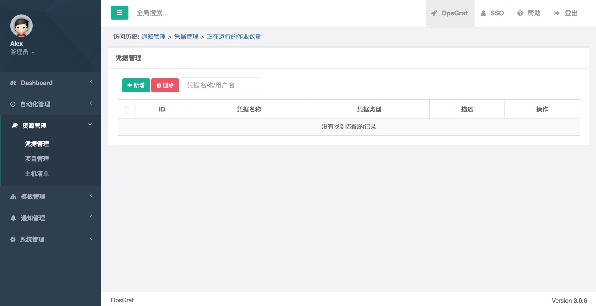
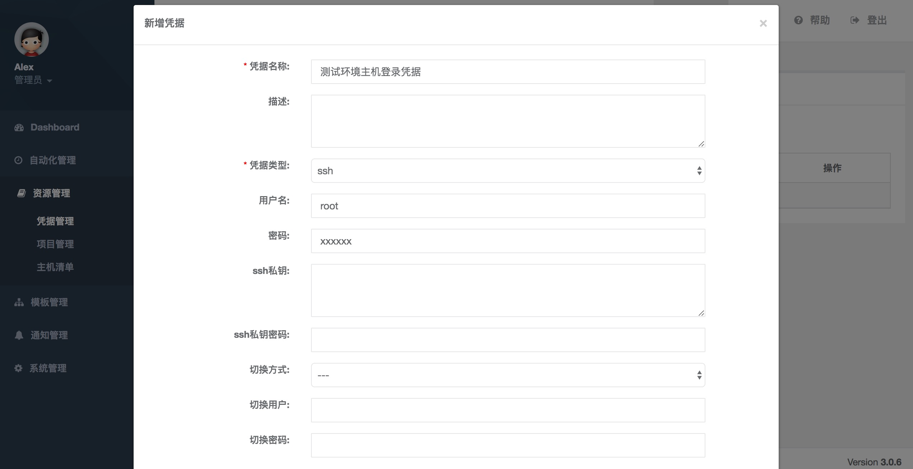
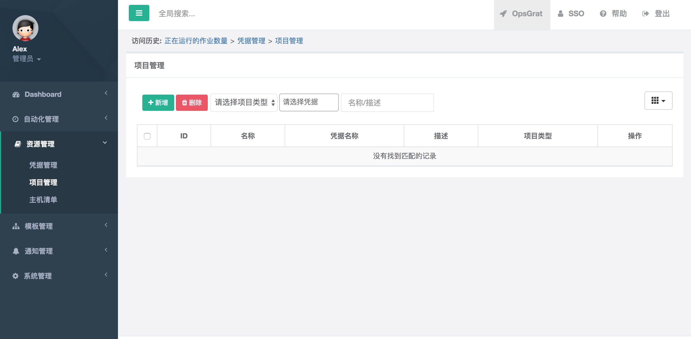
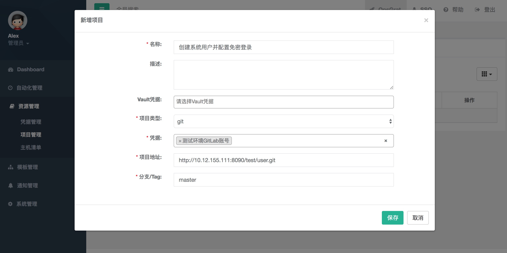
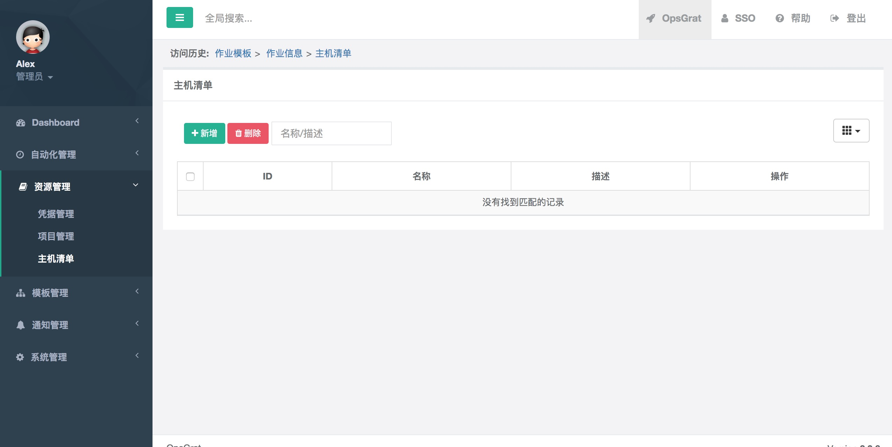
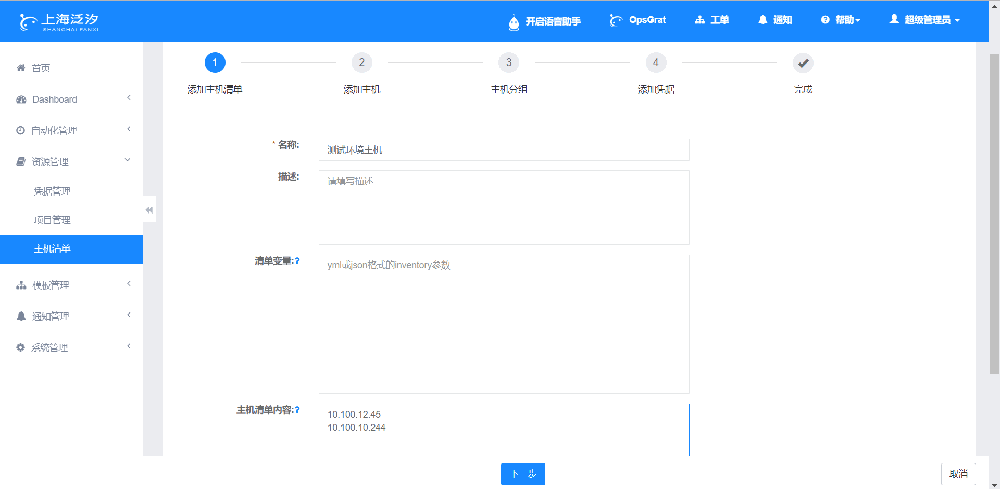
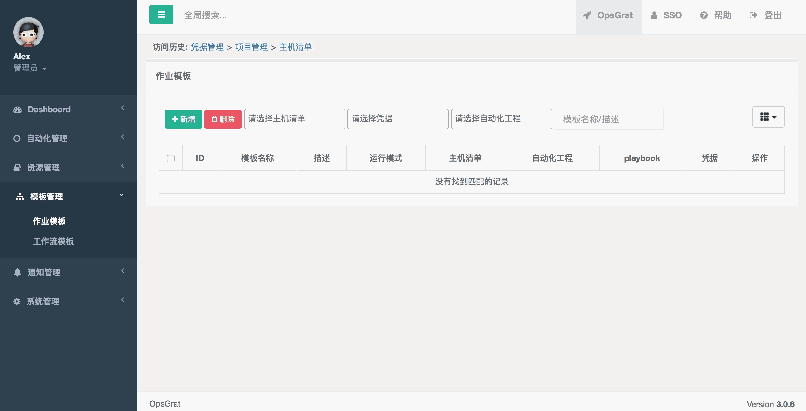
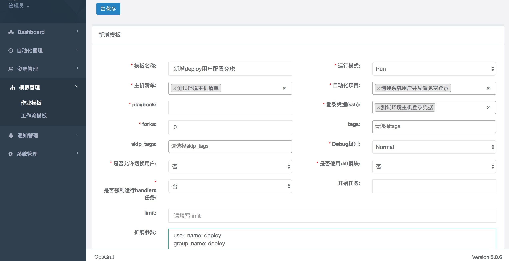
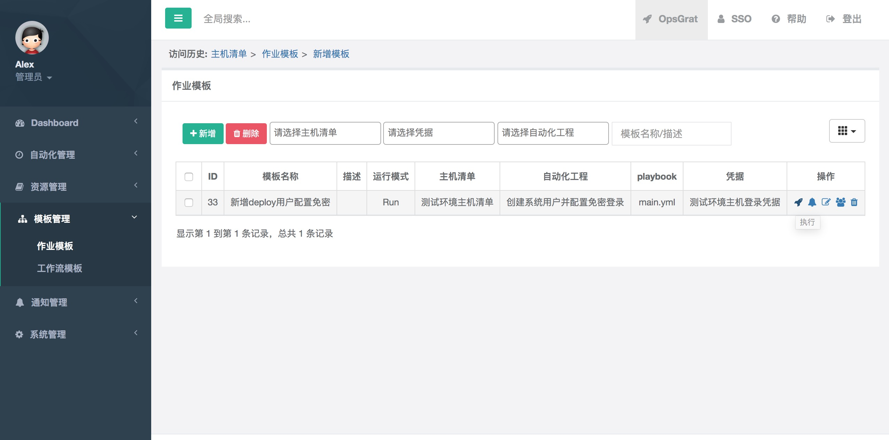
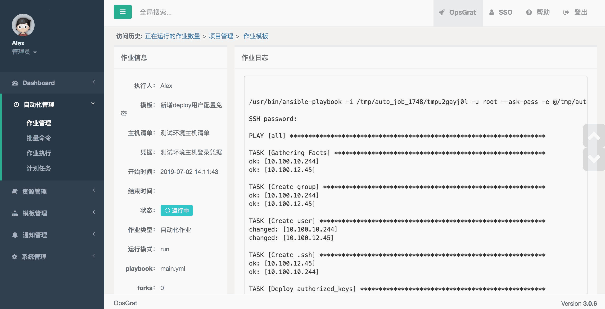

创建系统用户
==========================

一、创建user项目
--------------------------------

1.1、创建user目录，并进入user目录

1.2、创建main.yml文件，并写入如下内容：
::

   ---
   # 创建用户

   - hosts: all
     tasks:  
      - name: Create group
        group:
          name: "{{ group_name }}"
          state: present

      - name: Create user
        user:
          name: "{{ user_name }}"
          groups: "{{ group_name }}"
          state: present

      - name: Create .ssh
        file:
          path: "/home/{{ user_name }}/.ssh"
          owner: "{{ user_name }}"
          group: "{{ group_name }}"
          mode: 0700
          state: directory
       
   
      - name: Deploy authorized_keys
        copy: 
          src: authorized_keys
          dest: "/home/{{ user_name }}/.ssh/authorized_keys"
          owner: "{{ user_name }}"
          group: "{{ group_name }}"
          mode: 0600

1.3、创建files目录，并将公钥文件authorized_keys放入其中

1.4、将user上传到GitLab中，假设为：http://10.12.155.111:8090/test/user.git

二、配置凭据
------------------------------------

2.1、打开OpsGrat，点击左侧“资源管理”菜单下的“凭据管理”，进入凭据管理页面：

2.2、添加主机登录凭据，点击新增按钮，“凭据类型”选择“ssh“，添加登录主机的ssh凭据：
::
   
   ssh凭据可以设置通过用户名密码登录也可以配置通过ssh私钥登录
   本文假设通过用户名密码登录，则填写内容如图所示

2.3、添加GitLab凭据，点击新增按钮，“凭据类型”选择“用户名密码”
::

   GitLab用户密码只支持http的用户密码

.. image:: ../_static/img/example/pingju_gitlab.png

三、配置GitLab项目
---------------------------------

3.1、点击左侧“资源管理”菜单下的“项目管理”菜单，进入项目管理页面：

3.2、添加git项目，点击新增按钮，在新增表单中填写如下内容：
::
   名称：创建系统用户并配置免密登录
   项目类型：选择“git”
   凭据：选择步骤2.3中添加的“测试环境GitLab账号”
   项目地址：步骤1.4中上传的GitLab项目http地址
   分支/Tag：master

四、配置主机清单
--------------------------------

4.1、点击“主机清单”菜单，进入主机清单管理页面：

4.2、添加主机清单，点击新增按钮，在新增表单中填写如下内容：
::
   名称：测试环境主机
   主机清单内容：
                10.100.12.45
                10.100.10.244

五、配置作业模板
----------------------------

5.1、点击“模板管理”菜单下的“作业模板”菜单，进入作业模板管理页面：

5.2、添加作业模板，点击新增按钮，进入新增表单，填写如下内容：
::
   模板名称：新增deploy用户配置免密
   主机清单：选择步骤4.2添加的“测试环境主机清单”
   自动化项目：选择步骤3.2添加的“创建系统用户并配置免密登录”
   playbook：填写为步骤1.2的playbook文件名称“main.yml”
   登录凭据：选择步骤2.2添加的“测试环境主机登录凭据”
   扩展参数：设置playbook需要的参数user_name和group_name，yaml格式的，内容如下：
             user_name: deploy
             group_name: deploy
  
   注：创建其他用户只要修改扩展参数中user_name和group_name参数即可

5.3、添加成功后在“作业模板”页面点击执行按钮

5.4、点击“确认”执行后会打开执行日志页面，可以看到作业的执行过程

