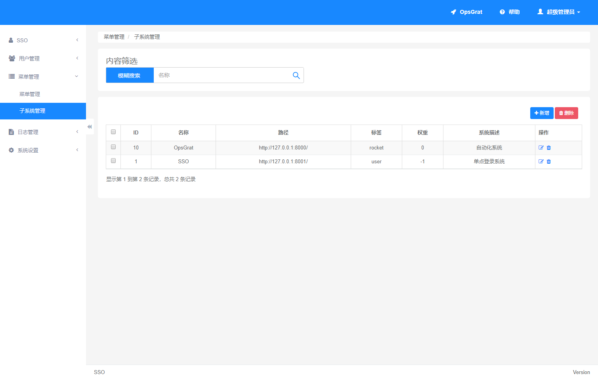
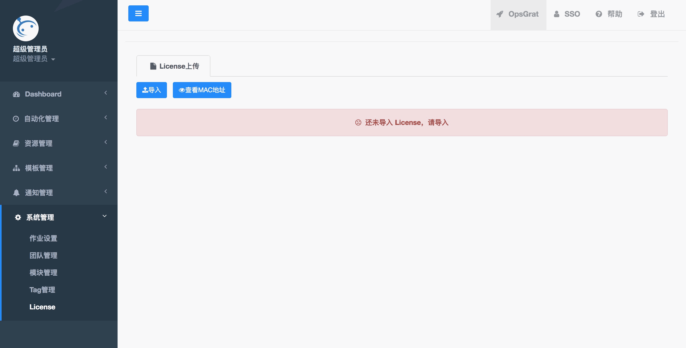
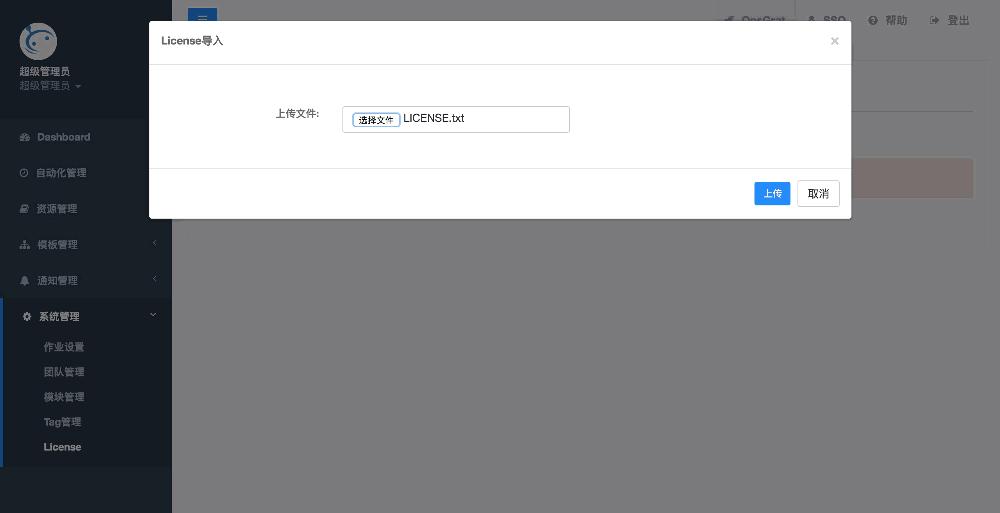

解压安装
==================

一、服务器要求
-----------------

- 操作系统：CentOS 7或Red Hat 7
- CPU: >= 4 Core
- 内存：>= 8 GB
- 磁盘：>= 40 GB

二、下载安装包
----------------

::

   下载地址为：http://download.opsgrat.com/
   安装包为：opsgrat.tar.gz

三、部署OpsGrat
---------------------------

::

   1、将安装包上传到服务器 /opt 目录下
   2、进入/opt目录执行解压：tar -zxvf opsgrat.tar.gz
   3、进入/opt/opsgrat目录执行setup.sh脚本进行服务部署和启动：cd /opt/opsgrat && sh setup.sh

四、登录SSO
-------------------------

::

   1、登录SSO，地址为：http://ip:8001/ (将ip替换为opsgrat服务器的ip地址)
   2、默认用户为：admin，默认密码为：admin

五、配置OpsGrat和SSO的访问路径
--------------------------------

::

   访问SSO系统的“菜单管理”中“子系统管理”菜单，如下图所示

::

   将上图中OpsGrat和SSO的路径中ip地址该为OpsGrat部署机器的ip地址

六、导入License
-------------------

::
   
   打开OpsGrat：http://ip:8000/ (将ip替换为opsgrat服务器的ip地址)
   第一次进入OpsGrat页面如下：

::

   点击“导入”按钮，选择License文件导入License

::
  
   Lincense导入成功后即可开始使用
