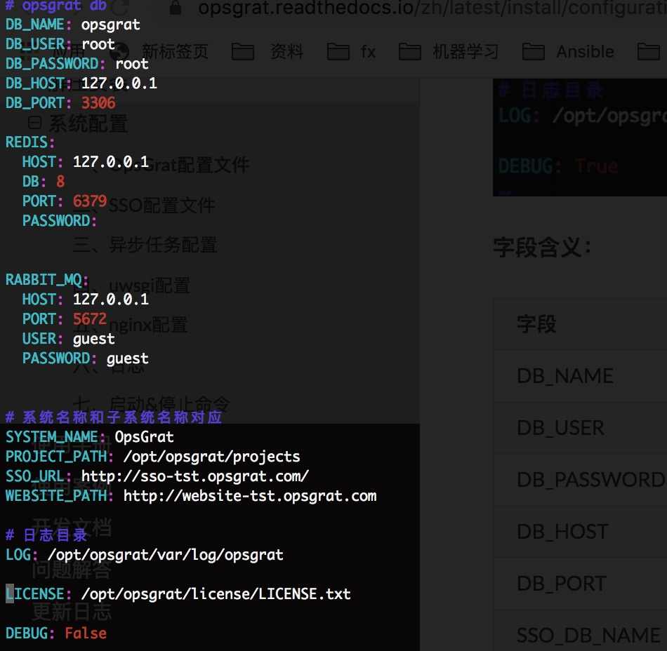
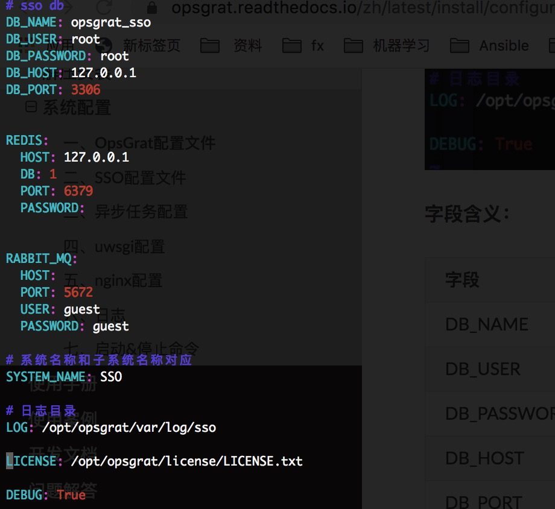

系统配置
==============================

**目标：**

::

   OpsGrat采用All In One解压安装，默认情况下不需要做任何配置修改即可使用

   本文将对OpsGrat的配置文件、日志以及启动方式作详细说明，以便帮助使用人员更好的对OpsGrat进行维护

**环境：**

- OS：CentOS 7/Red Hat 7
- Python: 3.7.4
- MySQL: 5.7
- Redis：主流版本
- RabbitMQ：主流版本
- Nginx：主流版本

一、OpsGrat配置文件
-------------------------------

::
   
   配置文件路径为：/opt/opsgrat/opsgrat/opsgrat/configs.yml
   
   OpsGrat默认配置如下图所示：

**字段含义：**

+------------------------+------------+------------+------------------------------------------------+
|**字段**                |**数据类型**|**是否必须**|**说明**                                        |
+------------------------+------------+------------+------------------------------------------------+
| DB_NAME                | String     | 是         | SSO数据库名称                                  |
+------------------------+------------+------------+------------------------------------------------+
| DB_USER                | String     | 是         | SSO数据库用户账号名                            |
+------------------------+------------+------------+------------------------------------------------+
| DB_PASSWORD            | String     | 是         | SSO数据库密码                                  |
+------------------------+------------+------------+------------------------------------------------+
| DB_HOST                | String     | 是         | SSO数据库主机名、ip地址或域名                  |
+------------------------+------------+------------+------------------------------------------------+
| DB_PORT                | String     | 是         | SSO数据库端口                                  |
+------------------------+------------+------------+------------------------------------------------+
| SSO_DB_NAME            | String     | 是         | SSO数据库名称                                  |
+------------------------+------------+------------+------------------------------------------------+
| SSO_DB_USER            | String     | 是         | SSO数据库用户账号名                            |
+------------------------+------------+------------+------------------------------------------------+
| SSO_DB_PASSWORD        | String     | 是         | SSO数据库密码                                  |
+------------------------+------------+------------+------------------------------------------------+
| SSO_DB_HOST            | String     | 是         | SSO数据库主机名、ip地址或域名                  |
+------------------------+------------+------------+------------------------------------------------+
| SSO_DB_PORT            | String     | 是         | SSO数据库主端口                                |
+------------------------+------------+------------+------------------------------------------------+
| REDIS:                 | Dict       | 是         | Redis配置                                      |
+------------------------+------------+------------+------------------------------------------------+
| - HOST                 | String     | 是         | Redis主机名、ip或域名                          |
+------------------------+------------+------------+------------------------------------------------+
| - PORT                 | String     | 是         | Redis端口                                      |
+------------------------+------------+------------+------------------------------------------------+
| - PASSWORD             | String     | 否         | Redis密码                                      |
+------------------------+------------+------------+------------------------------------------------+
| RABBIT_MQ:             | Dict       | 是         | Rabbitmq配置                                   |
+------------------------+------------+------------+------------------------------------------------+
| - HOST                 | String     | 否         | RABBIT_MQ主机名、ip或域名，空表示使用redis     |
+------------------------+------------+------------+------------------------------------------------+
| - PORT                 | String     | 否         | RABBIT_MQ端口                                  |
+------------------------+------------+------------+------------------------------------------------+
| - USER                 | String     | 否         | RABBIT_MQ用户名                                |
+------------------------+------------+------------+------------------------------------------------+
| - PASSWORD             | String     | 否         | RABBIT_MQ密码                                  |
+------------------------+------------+------------+------------------------------------------------+
| SYSTEM_NAME            | String     | 是         | 系统名称，与SSO中OpsGrat的子系统名称对应       |
+------------------------+------------+------------+------------------------------------------------+
| LOG                    | String     | 是         | OpsGrat系统日志路径                            |
+------------------------+------------+------------+------------------------------------------------+
| DEBUG                  | String     | 是         | 是否开启debug模式                              |
+------------------------+------------+------------+------------------------------------------------+

二、SSO配置文件
------------------------------

::

   配置文件路径为：/opt/opsgrat/sso/sso/configs.yml

   SSO默认配置如下图所示：

**字段含义：**

+------------------------+------------+------------+------------------------------------------------+
|**字段**                |**数据类型**|**是否必须**|**说明**                                        |
+------------------------+------------+------------+------------------------------------------------+
| DB_NAME                | String     | 是         | SSO数据库名称                                  |
+------------------------+------------+------------+------------------------------------------------+
| DB_USER                | String     | 是         | SSO数据库用户账号名                            |
+------------------------+------------+------------+------------------------------------------------+
| DB_PASSWORD            | String     | 是         | SSO数据库密码                                  |
+------------------------+------------+------------+------------------------------------------------+
| DB_HOST                | String     | 是         | SSO数据库主机名、ip地址或域名                  |
+------------------------+------------+------------+------------------------------------------------+
| DB_PORT                | String     | 是         | SSO数据库端口                                  |
+------------------------+------------+------------+------------------------------------------------+
| REDIS:                 | Dict       | 是         | Redis配置                                      |
+------------------------+------------+------------+------------------------------------------------+
| - HOST                 | String     | 是         | Redis主机名、ip或域名                          |
+------------------------+------------+------------+------------------------------------------------+
| - PORT                 | String     | 是         | Redis端口                                      |
+------------------------+------------+------------+------------------------------------------------+
| - PASSWORD             | String     | 否         | Redis密码                                      |
+------------------------+------------+------------+------------------------------------------------+
| RABBIT_MQ:             | Dict       | 是         | Rabbitmq配置                                   |
+------------------------+------------+------------+------------------------------------------------+
| - HOST                 | String     | 否         | RABBIT_MQ主机名、ip或域名，空表示使用redis     |
+------------------------+------------+------------+------------------------------------------------+
| - PORT                 | String     | 否         | RABBIT_MQ端口                                  |
+------------------------+------------+------------+------------------------------------------------+
| - USER                 | String     | 否         | RABBIT_MQ用户名                                |
+------------------------+------------+------------+------------------------------------------------+
| - PASSWORD             | String     | 否         | RABBIT_MQ密码                                  |
+------------------------+------------+------------+------------------------------------------------+
| SYSTEM_NAME            | String     | 是         | 系统名称，与SSO中OpsGrat的子系统名称对应       |
+------------------------+------------+------------+------------------------------------------------+
| LOG                    | String     | 是         | OpsGrat系统日志路径                            |
+------------------------+------------+------------+------------------------------------------------+
| DEBUG                  | String     | 是         | 是否开启debug模式                              |
+------------------------+------------+------------+------------------------------------------------+

三、异步任务配置
--------------------------

::

   OpsGrat和SSO的异步任务配置在 /opt/opsgrat/etc/supervisor/conf.d 目录中

**任务进程描述：**

+------------------------+--------------------------------------------------------------------------+
|**配置文件**            |**说明**                                                                  |
+------------------------+--------------------------------------------------------------------------+
| opsgratd.ini           | OpsGrat自动化作业进程，默认进程数为10（按8Core*16G服务器配置）           |
+------------------------+--------------------------------------------------------------------------+
| notification.ini       | OpsGrat通知进程，用于发送作业执行结果通知，默认进程数为5                 |
+------------------------+--------------------------------------------------------------------------+
| opsgratbeat.ini        | OpsGrat定时任务进程，用于生成计划任务作业                                |
+------------------------+--------------------------------------------------------------------------+
| ssod.ini               | SSO异步任务进程，用于执行AD用户同步等异步任务，默认进程数为2             |
+------------------------+--------------------------------------------------------------------------+

::
 
   注：opsgratd.ini中--concurrency参数表示进程数量，需要根据服务器实际配置进行调整，一般配置为服务器CPU核数+1

四、uwsgi配置
----------------------------

::

   OpsGrat uwsgi进程配置为：/opt/opsgrat/uwsgi/opsgrat-uwsgi.ini
   默认端口为：7500
   默认进程数为：4
   supervisor配置为：/opt/opsgrat/etc/supervisor/conf.d/opsgrat-web.ini

::
 
   SSO uwsgi进程配置为：/opt/opsgrat/uwsgi/sso-uwsgi.ini
   默认端口为：7501
   默认进程数为：4
   supervisor配置为：/opt/opsgrat/etc/supervisor/conf.d/sso-web.ini

五、nginx配置
---------------------------

::

   OpsGrat nginx配置文件路径为：/opt/opsgrat/nginx/etc/nginx/conf.d/opsgrat.conf
   OpsGrat默认web访问端口为8000，可以在配置文件中修改该端口
   
   SSO nginx配置文件路径为：/opt/opsgrat/nginx/etc/nginx/conf.d/sso.conf
   SSO默认web访问端口为8001，可以在配置文件中修改该端口

六、日志
-----------------------------

**OpsGrat日志：**

::

   OpsGrat日志文件路径为：/opt/opsgrat/var/log/opsgrat/

   opsgrat-worker.log为OpsGrat自动化作业的日志，可以看到OpsGrat自动化作业的执行情况以便进行作业追踪和调试

   notification-worker.log为OpsGrat通知进程的日志

   opsgrat_error.log和opsgrat.log是OpsGrat web后台的日志

**SSO日志：**

::

   SSO日志文件路径为：/opt/opsgrat/var/log/sso/
  
   sso-worker.log为sso异步任务的日志

   sso.log和sso_error.log是SSO web后台的日志

**supervisor日志：**

::

   supervisor的日志路径为：/opt/opsgrat/var/log/supervisor/

   supervisor日志可以看到OpsGrat和SSO各个进程的启动和运行情况以便排除进程无法启动等问题

七、启动&停止命令
------------------------------

**supervisord进程：**

::
 
   supervisord进程默认为开机启动
   启动命令：systemctl start supervisord
   停止命令：systemctl stop supervisord
   重启命令：systemctl restart supervisord
   开机启动：systemctl enable supervisord
   取消开机启动：systemctl disable supervisord

**OpsGrat和SSO进程：**

::

   OpsGrat和SSO的进程默认使用supervisor进行管理
   启动命令：supervisorctl -c /opt/opsgrat/etc/supervisor/supervisord.conf start all
   停止命令：supervisorctl -c /opt/opsgrat/etc/supervisor/supervisord.conf stop all
   重启命令：supervisorctl -c /opt/opsgrat/etc/supervisor/supervisord.conf restart all
   查看进程：supervisorctl -c /opt/opsgrat/etc/supervisor/supervisord.conf

**nginx进程：**

::

   nginx提供OpsGrat和SSO web访问服务，nginx进程默认为开机启动
   启动命令：systemctl start nginx
   停止命令：systemctl stop nginx
   重启命令：systemctl restart nginx
   开机启动：systemctl enable nginx
   取消开机启动：systemctl disable nginx
 
**MySQL进程：**

:: 

   MySQL默认为开机启动
   启动命令：service mysql start
   停止命令：service mysql stop
   重启命令：service mysql restart 
   开机启动：systemctl enable mysql
   取消开机启动：systemctl disable mysql

**Redis进程：**

::

   Redis作为celery异步任务执行结果缓存以及OpsGrat作业日志缓存，Redis默认为开机启动
   启动命令：systemctl start redis
   停止命令：systemctl stop redis
   重启命令：systemctl restart redis
   开机启动：systemctl enable redis
   取消开机启动：systemctl disable redis

**RabbitMQ进程：**

::

   rabbitmq作为celery异步任务broker进程，rabbitmq默认为开机启动
   启动命令：systemctl start rabbitmq-server
   停止命令：systemctl stop rabbitmq-server
   重启命令：systemctl restart rabbitmq-server
   开机启动：systemctl enable rabbitmq-server
   取消开机启动：systemctl disable rabbitmq-server
