快速安装
=============================

快速安装


OpsGrat Web 程序安装
````````````````````````

::

   整个过程分成八个部分，其中包括（检查环境配置、设置基本信息、设置MySQL、设置端口、设置Redis、设置Rabbit、安装中、安装完成）具体安装步骤如下

::

   第一步：检查环境配置(若出现某些软件没有安装，我们会在后面自动帮你装上),然后点击下一步。

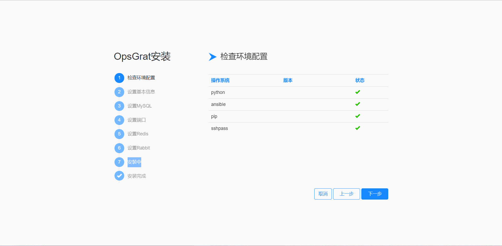

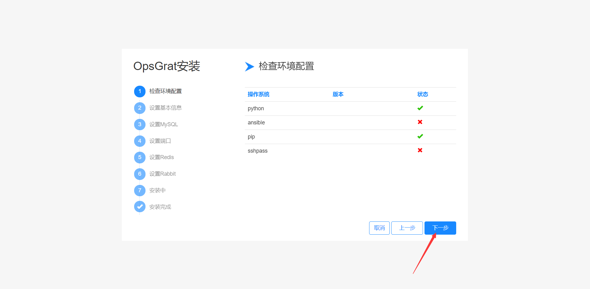


::

   第二步：设置基本信息,可以自主填写相应的数据。

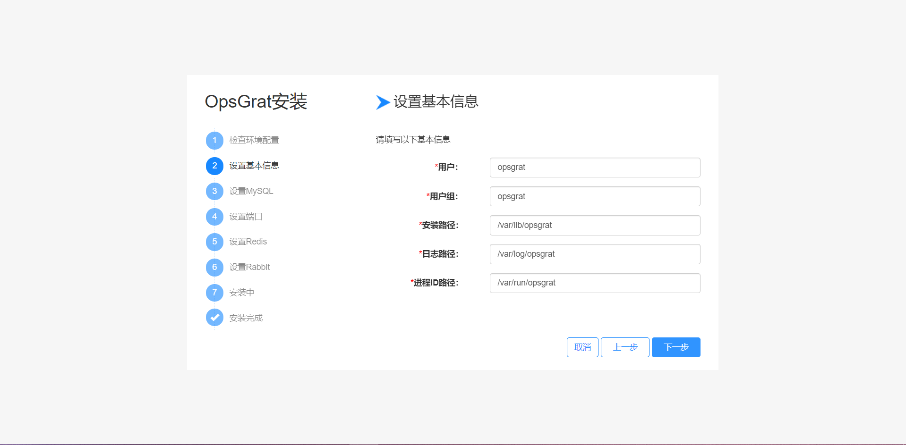

::

  第三步：设置MySQL,可以自主填写相应的数据，这一步设置为OpsGrat以及SSO单点登录系统提供了后台数据存储的数据库，其中填写数据时注意框内提示，正确填写。

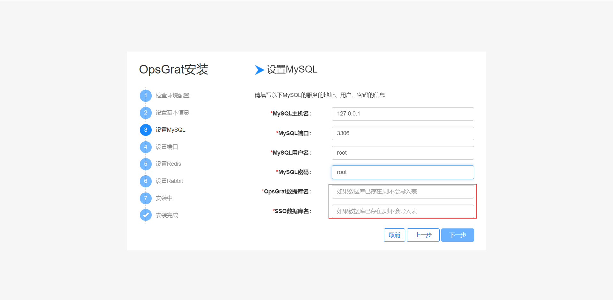

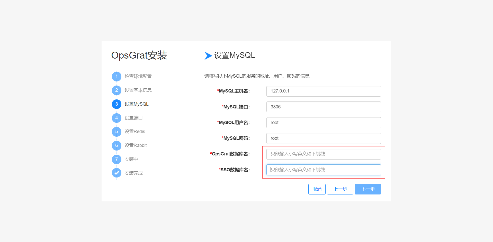

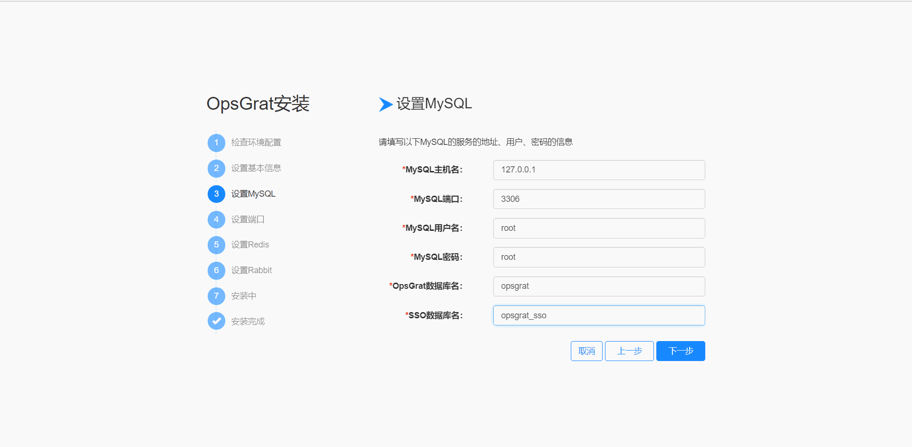


::

   第四步：设置端口、这一步设置是为了确定Nginx和Uwsgi端口号，以便后面使用相应的端口去访问系统，同时填写数据时注意框内提示，正确填写。

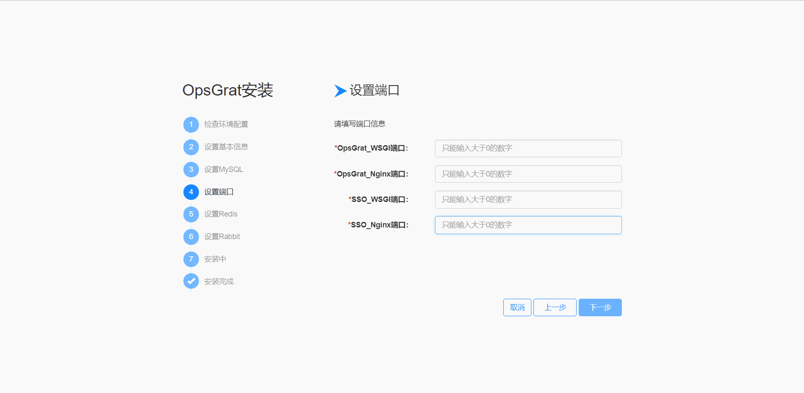

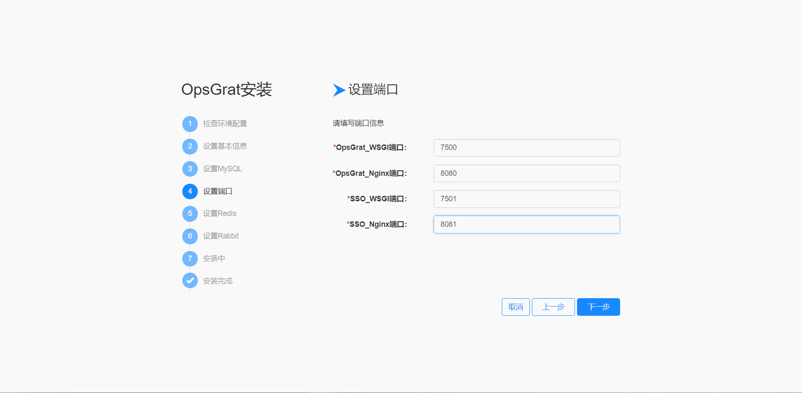


::

  第五步：设置Redis、填写相应的数据来供应OpsGrat系统使用、同时填写数据时注意框内提示，正确填写。

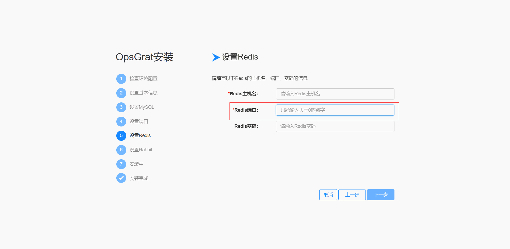

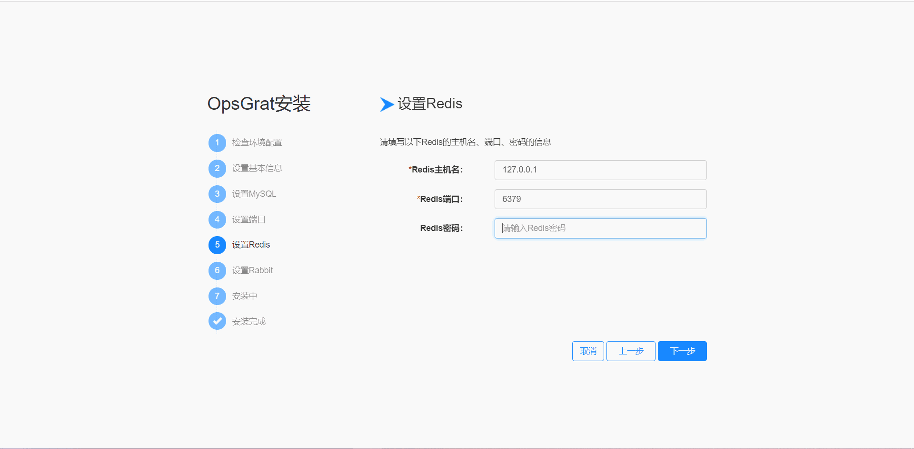

::

  第六步：设置Rabbit,填写相应的数据来供应OpsGrat系统使用，同时填写数据时注意框内提示，正确填写。

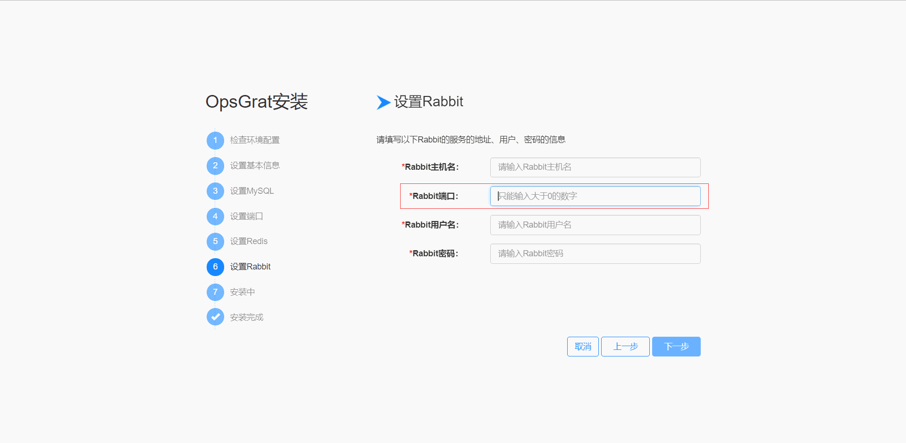

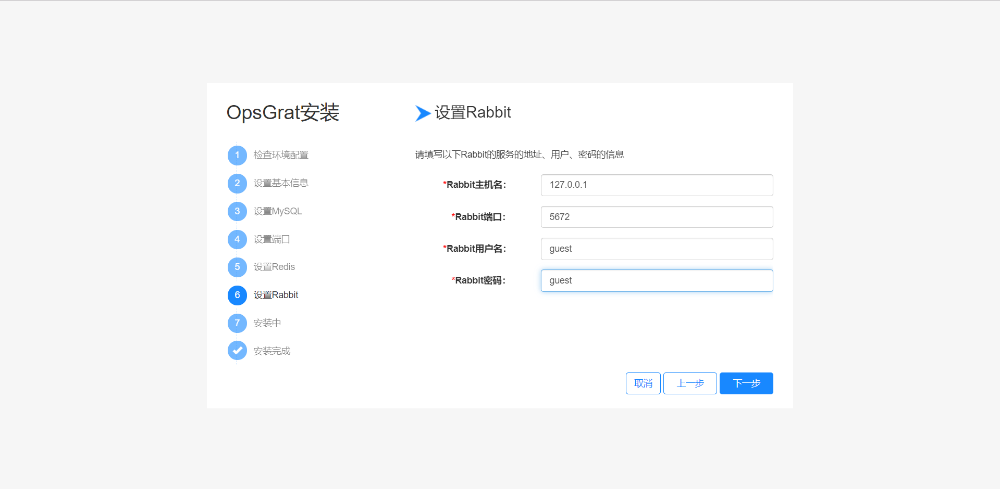

::

  第七步：安装OpsGrat，该页面会展示出当前后台日志的运行情况，当日志存在如下图中红框内的提示，则说明安装失败。此时会出现上一步按钮和重试按钮，可以根据日志提示的错误信息点击相应的按钮来解决问题。若出现像下图中的第三张，说明安装成功。同时在安装时候可以点击停止按钮，来停止安装。具体如下图

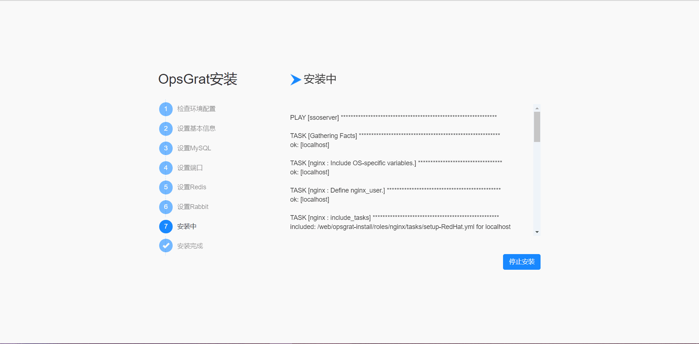

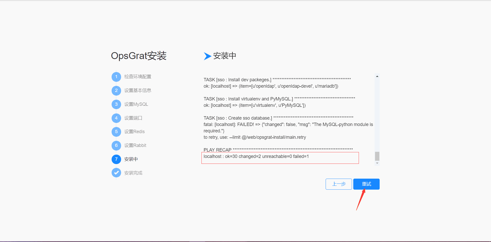

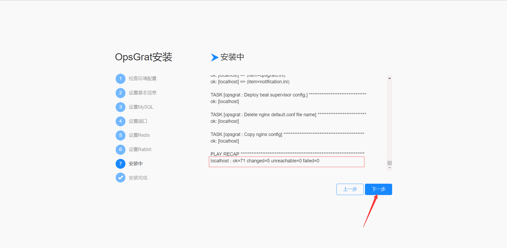

::

   第八步：OpsGrat安装成功，点击开始使用OpsGrat按钮，第一次使用页面跳转到SSO单点系统的登录页面，其中用户名和密码在用户来接收License的邮箱里。

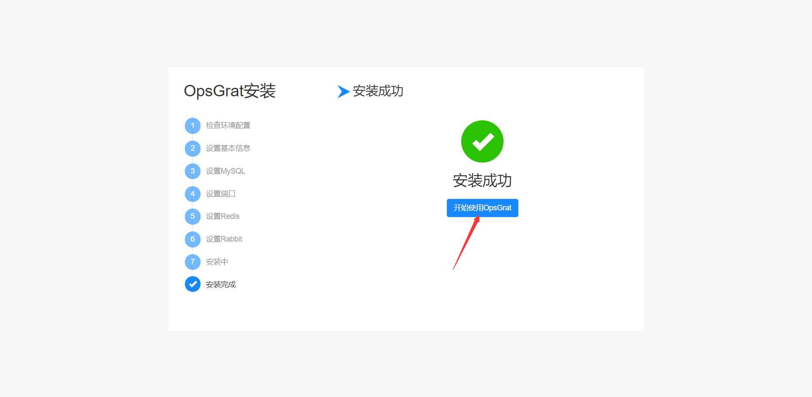

