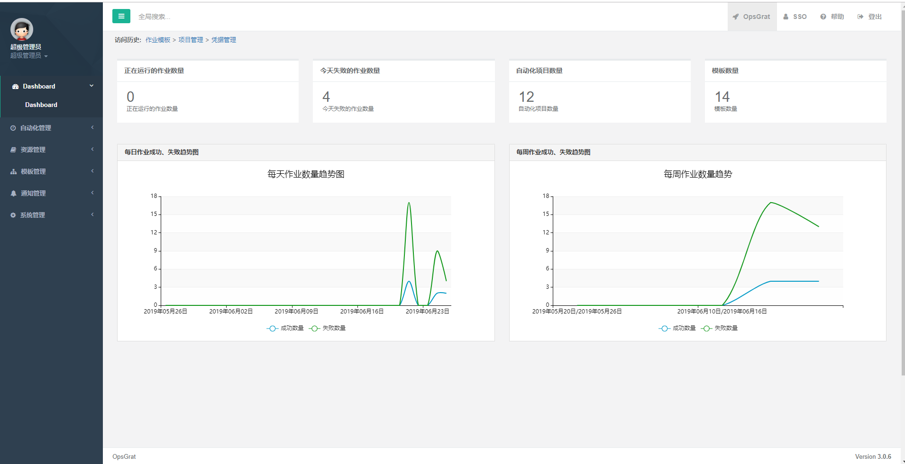

Dashboard
==========================
一、仪表图查看
````````````````````

**1.1 仪表图查看**
--------------------

.. code-block:: vim

    打开Opsgrat，点击页面左侧菜单栏中“Dashboard”下的“Dashboard”进入仪表盘查看页面,
    在该页面可以查看正在运行、失败的作业数量和自动化项目数量、模板数量，
    以及可以看到每日和每周作业成功和失败的数量趋势图


