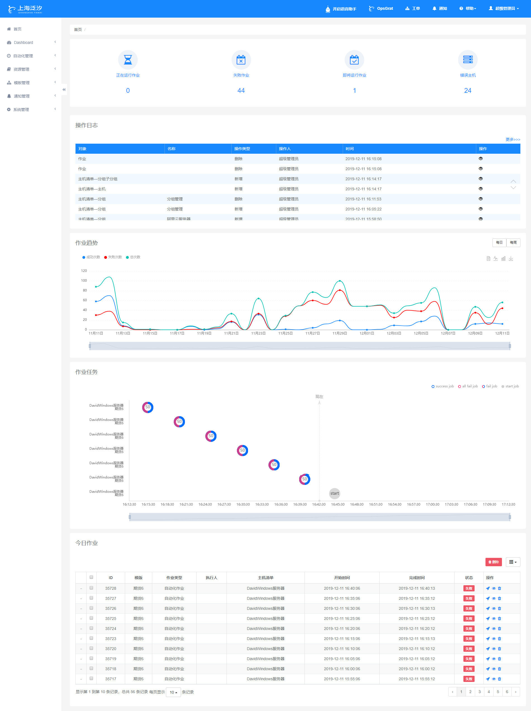
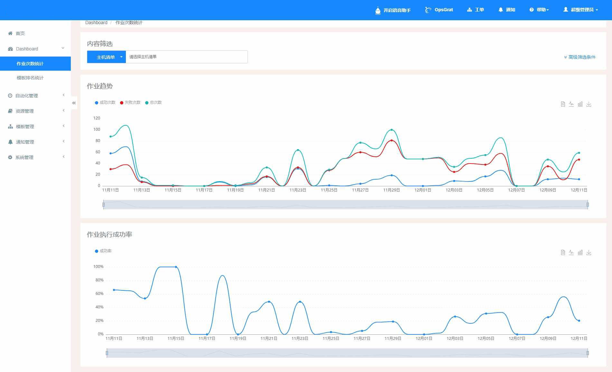
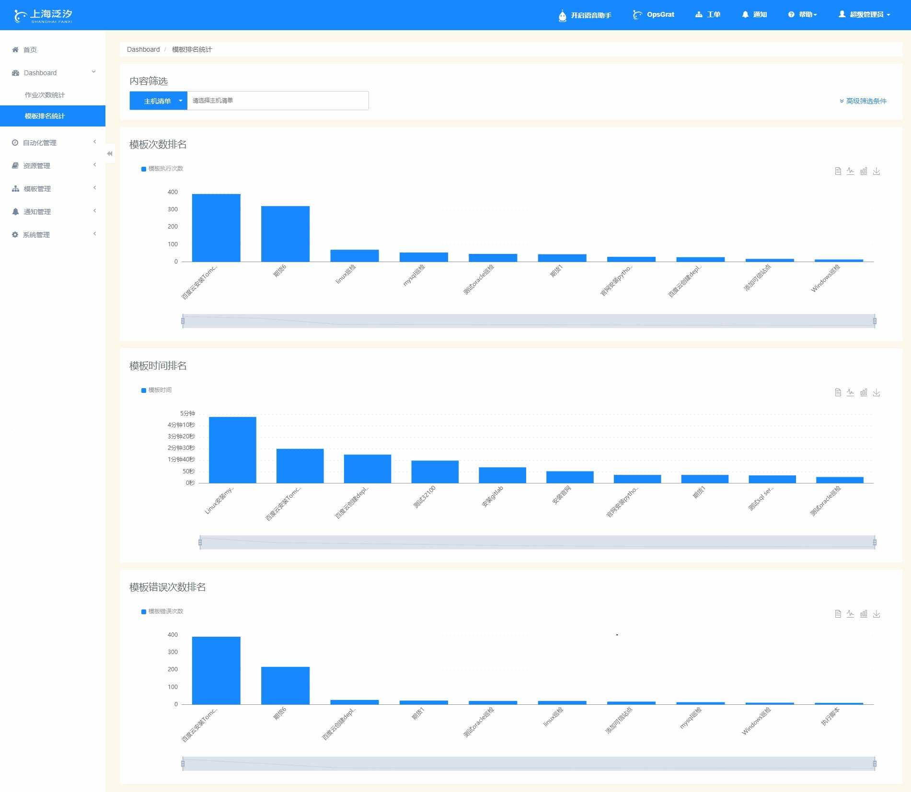

Dashboard
==========================
一、仪表图查看
````````````````````

**1.1 仪表图查看**
--------------------

.. code-block:: vim

    打开Opsgrat，点击页面左侧菜单栏中“首页”进入仪表盘查看页面,
    在该页面最上方可以查看正在运行的作业、失败的作业、即将运行作业、和错误主机的数量，
    其次可以看到操作日志，可以自己切换的每日或每周的作业趋势图，
    以及可以看到作业任务的散点图和最后面的今日作业。



**1.2 作业次数统计图查看**
--------------------

.. code-block:: vim

    打开Opsgrat，点击页面左侧菜单栏中“Dashboard”下的“作业次数统计”进入作业次数统计查看页面,
    在该页面可以查看作业趋势图，成功次数、失败次数和总次数的详情情况，
    其次可以查看作业执行的成功率情况。




**1.3 模板排名统计图查看**
--------------------

.. code-block:: vim

    打开Opsgrat，点击页面左侧菜单栏中“Dashboard”下的“模板排名统计”进入模板排名统计查看页面,
    在该页面可以查看模板执行次数前十的模板名称以及数量，
    其次可以查看模板执行时间前十的模板名称以及时间，
    以及可以查看模板错误次数前十的模板名称以及数量。


