通知管理
=========================

一、通知设置
````````````````````````

::

   点击左侧的菜单“通知管理”下的“通知设置菜单”

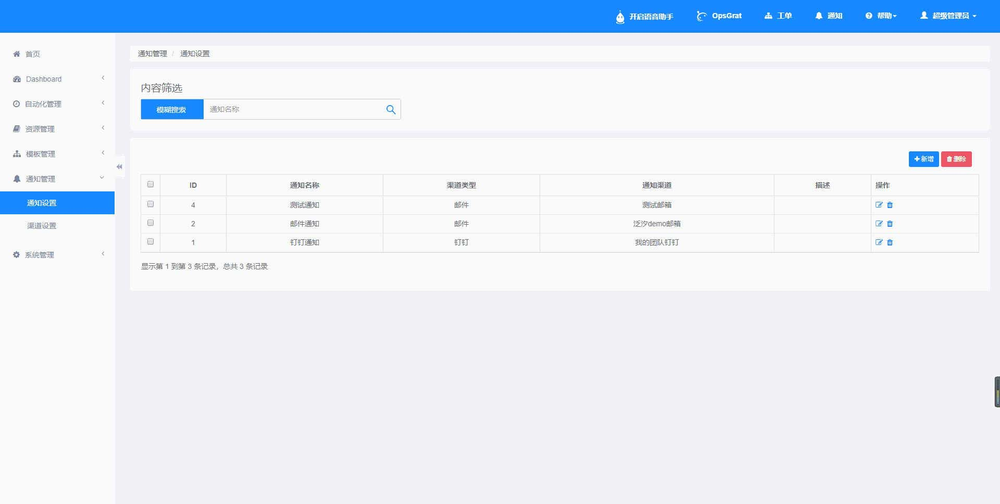

::

   点击新增按钮，渠道类型选择邮件（其中通知渠道下拉框值要在通知管理--渠道设置中新增数据才可显示）、目前渠道类型有三种：钉钉，邮件，企业微信


::

    新增渠道类型选择钉钉（其中通知渠道下拉框值要在通知管理--渠道设置中新增数据才可显示）

.. image:: ../_static/img/using/notification/notification_dingtalk.jpg

::

    新增渠道类型选择企业微信（其中通知渠道下拉框值要在通知管理--渠道设置中新增数据才可显示）

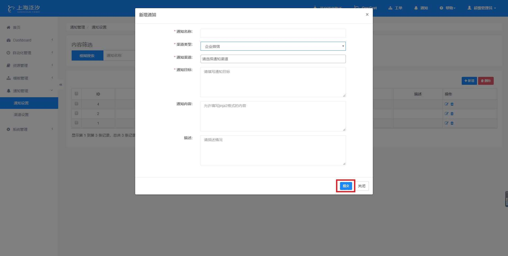

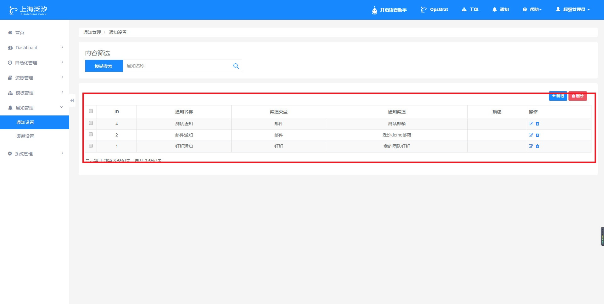

::

    同时可以进行修改、查询、删除等操作，与前面所介绍的执行功能结果一样，这里不再做赘述


二、渠道设置
````````````````````````

::

    点击左侧菜单“通知管理”下的“渠道设置菜单”

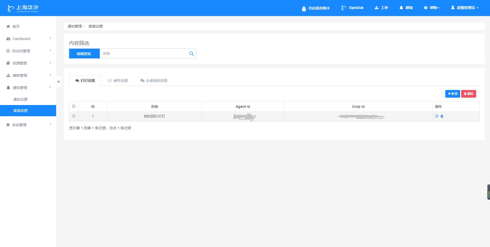

::

    在钉钉页面点击新增按钮，可以添加相应数据

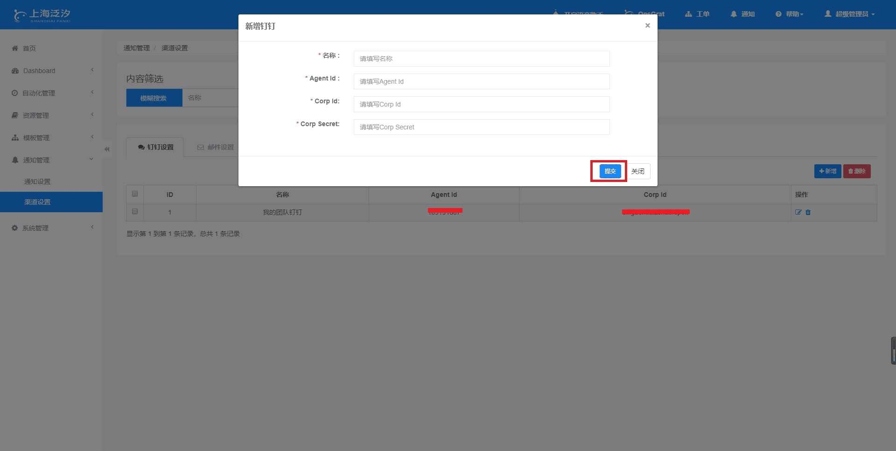

::

    在钉钉页面点击修改按钮，可以修改相应数据


::

    在钉钉页面点击删除按钮，可以删除当前行数据

.. image:: ../_static/img/using/notification/notification_channel_delete.jpg

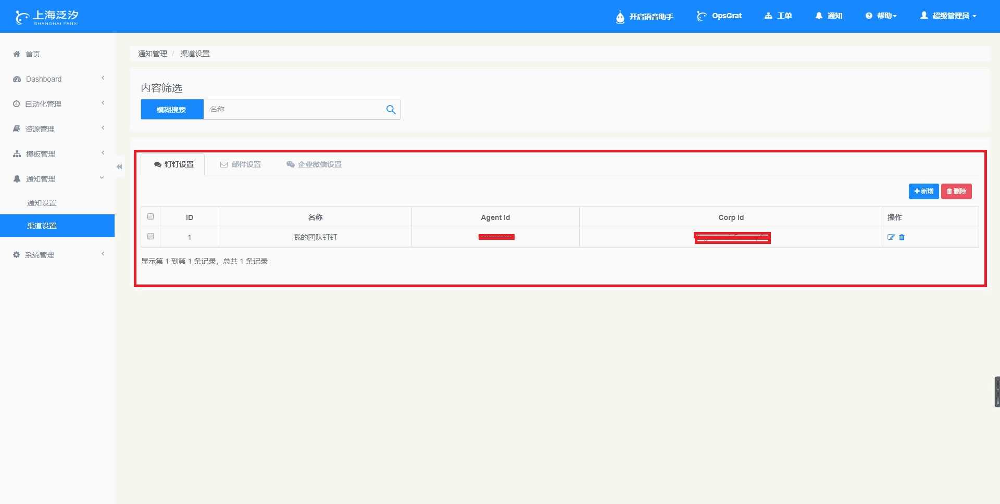

::

    点击页面上的邮件设置页卡按钮

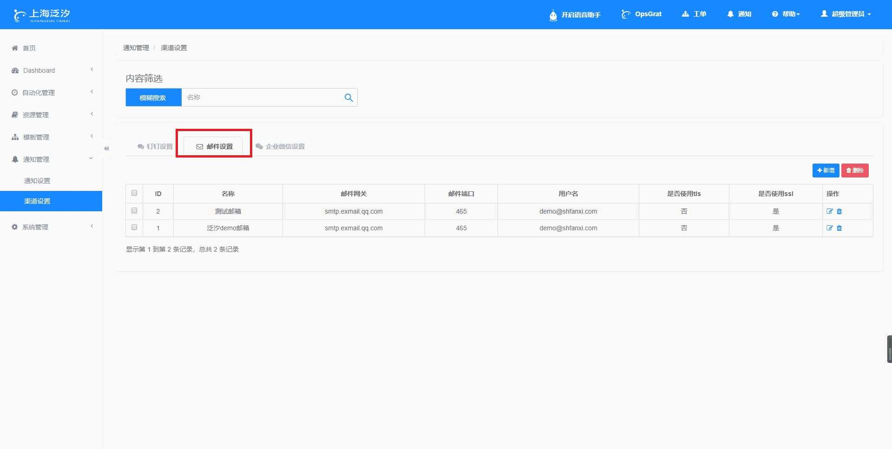

::

    在邮件设置页面点击修改按钮，可以修改相关数据

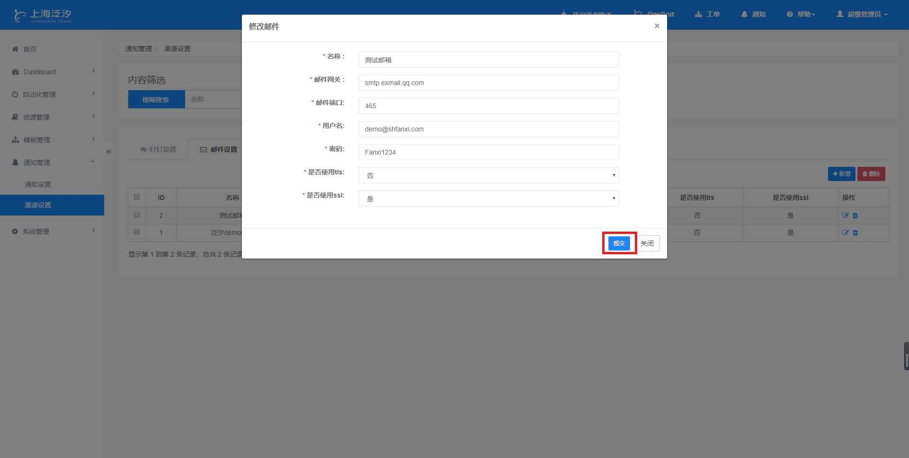

::

    在邮件设置页面点击删除按钮，可以删除当前行数据

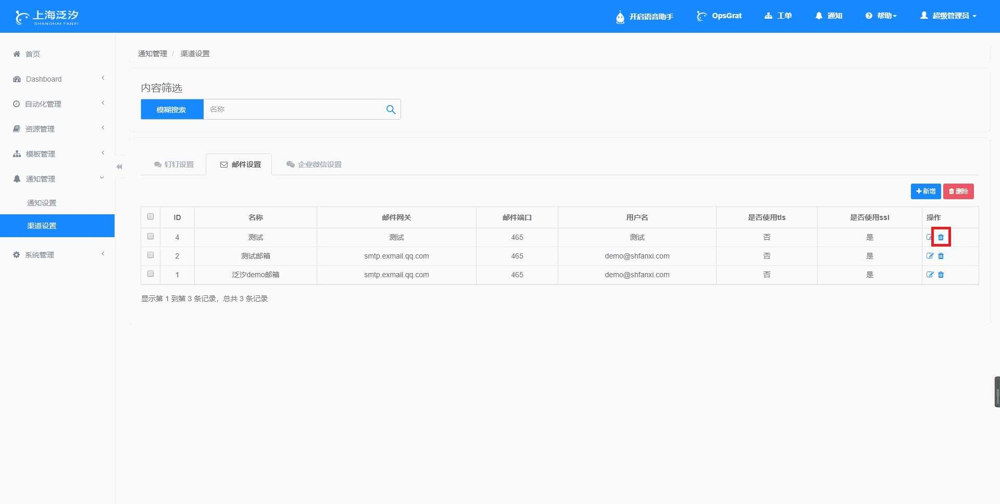

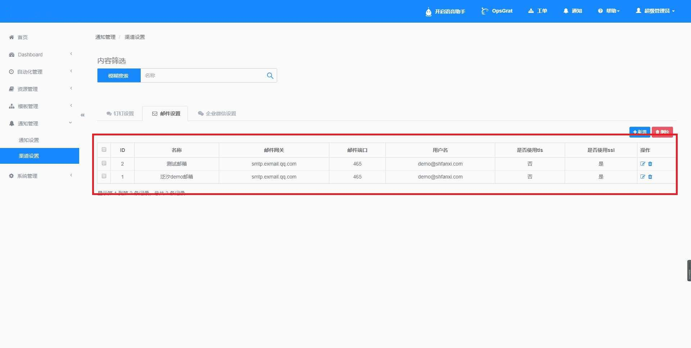

::

    点击页面上的企业微信设置按钮，跳转到企业微信设置页面

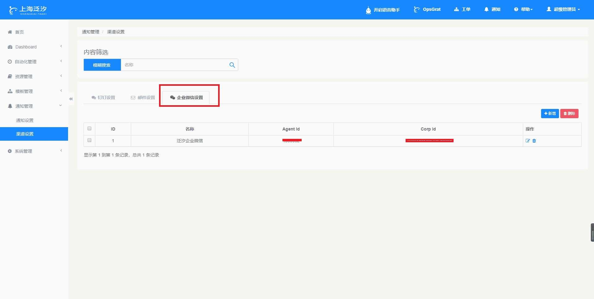

::

    在此页面可以进行新增、修改、删除等操作、功能与前面所介绍的钉钉设置一样，这里不再赘述