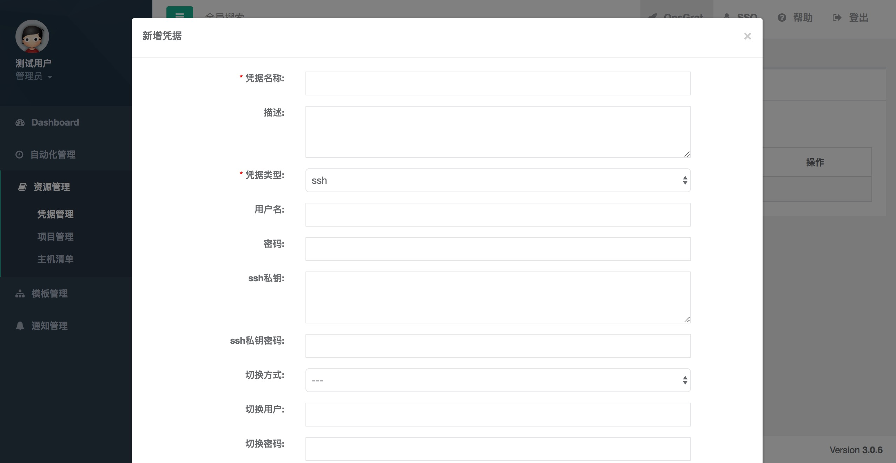

快速入门
=======================

说明
````````````
- 通过例子引导OpsGrat的配置和使用

一、SSO设置
````````````````````

**1.1 子系统设置**
--------------------

.. code-block:: vim
    
    打开SSO，点击页面左侧菜单栏中“菜单管理”下的“子系统管理”进入子系统管理页面
    修改OpsGrat和SSO的路径，改成实际的访问路径

**1.2 ldap设置**
--------------------

.. code-block:: vim

    如果不使用ldap认证可以跳过该步骤
    
.. image:: ../_static/img/using/settings_ldap.png

**1.3 添加用户**
--------------------

.. code-block:: vim

    点击“用户管理”下的“用户管理”菜单，进入用户管理页面。
    如果配置了ldap则在“新增”按钮后面会有一个“AD”按钮，如下图。点击“AD”按钮会从ldap获取用户
    如果没有配置ldap则需要手工为自己添加用户，是否管理员设置为“是”
    然后使用新的用户重新登录SSO

.. image:: ../_static/img/using/sso_user.png

二、资源管理
````````````````````

**2.1 添加ssh登录凭据**
-----------------------------

::

    点击右上方“OpsGrat”导航栏，跳转到OpsGrat系统
    点击左侧菜单“资源管理”下的“凭据管理菜单”

.. image:: ../_static/img/using/pingju.png

::

    点击“新增”按钮，新增凭据类型为ssh的凭据



**2.2 添加git凭据**
---------------------------

**2.3 添加项目**
--------------------------

**2.4 添加主机清单**
---------------------------


三、通知管理
````````````````````

**3.1 添加邮件设置**
---------------------------

**3.2 添加通知设置**
---------------------------

四、模板管理
``````````````````````````

**4.1 添加作业模板**
-------------------------

**4.2 执行作业模板**
---------------------------
   
五、自动化管理
````````````````````

**5.1 批量命令执行**
--------------------------

**5.2 查看作业日志**
-------------------------

**5.3 执行作业**
------------------------

**5.4 设置计划任务**
--------------------------


    
