资源管理
=============================

一、凭据管理
````````````````````

**1.1 查看凭据**
--------------------

.. code-block:: vim

    点击“资源管理”下的“凭据管理”菜单，进入凭据管理页面，可以在该页面查看所有添加的凭据。
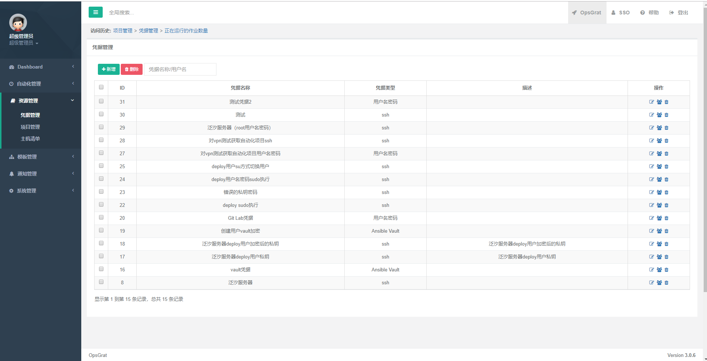

**1.2 查询**
--------------------

.. code-block:: vim

    点击搜索模态框，可以根据根据凭据名称和用户名进行搜索查询。


**1.3 添加凭据**
--------------------

.. code-block:: vim

    点击“新增”按钮，根据模态框新增相应得数据进行添加凭据。


**1.4 修改凭据**
--------------------

.. code-block:: vim

    点击操作栏下的“修改”按钮，根据模态框相应得数据进行修改凭据。

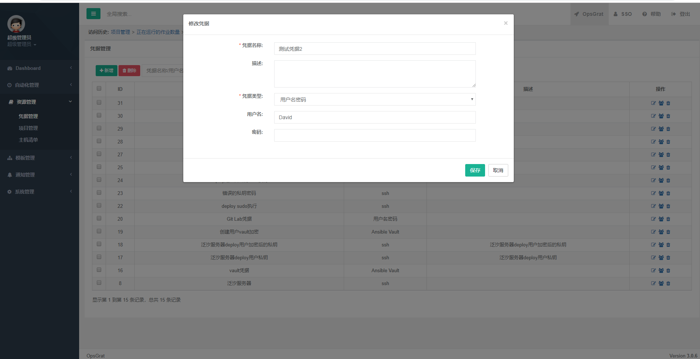

**1.5 删除凭据**
--------------------

.. code-block:: vim

    点击操作栏下的“删除”按钮，可以删除该凭据。

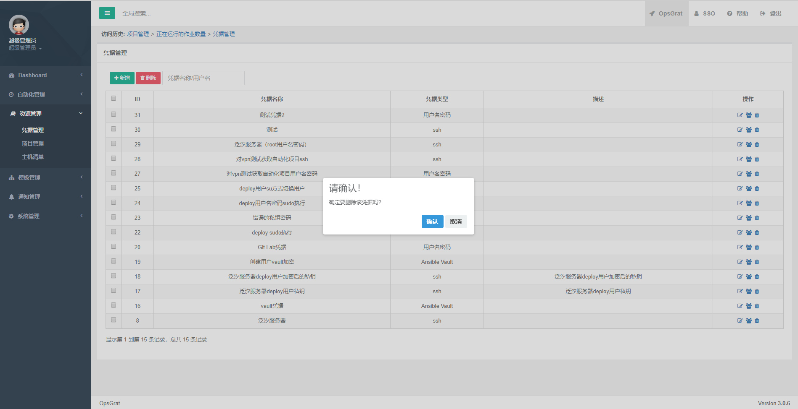

**1.6.1 权限管理（授权用户）**
--------------------

.. code-block:: vim

    点击操作栏下的“权限管理”按钮，可进入到授权用户界面。

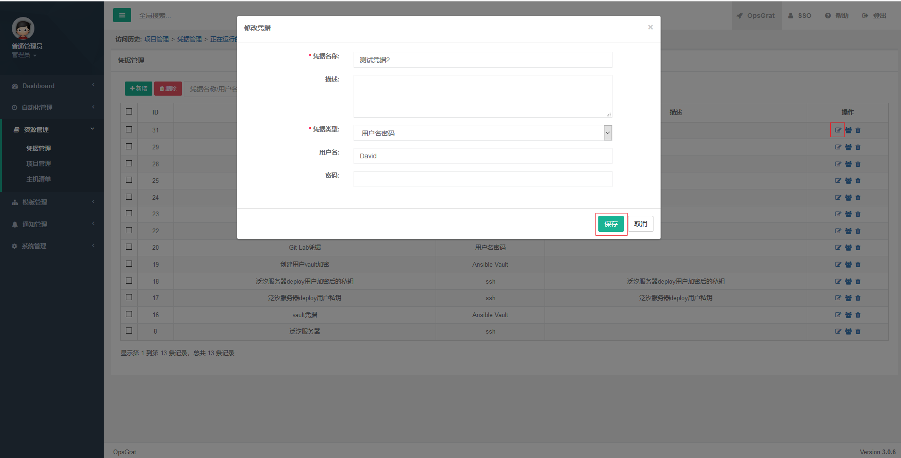

**1.6.2 权限管理（授权用户）查询**
--------------------

.. code-block:: vim

    点击搜索模态框，可以根据根据凭据名称和用户名进行搜索查询。


**1.6.3 权限管理（授权用户）新增**
--------------------

.. code-block:: vim

    点击“新增”按钮，根据模态框新增相应得数据进行添加授权用户。

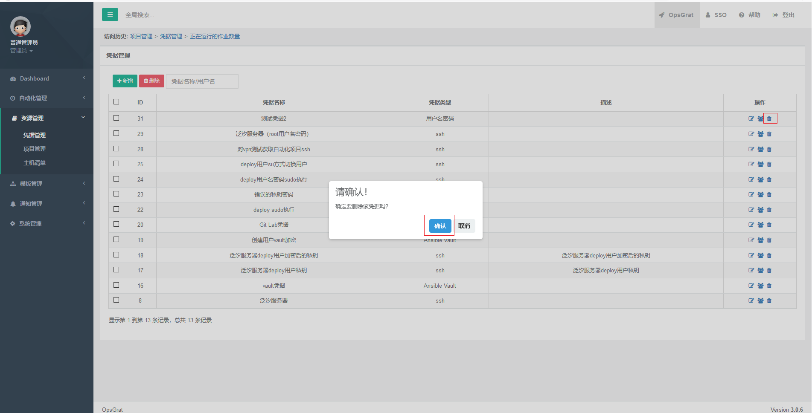

**1.6.4 权限管理（授权用户）修改**
--------------------

.. code-block:: vim

    点击操作栏下的“修改”按钮，根据模态框相应得数据进行修改凭据。

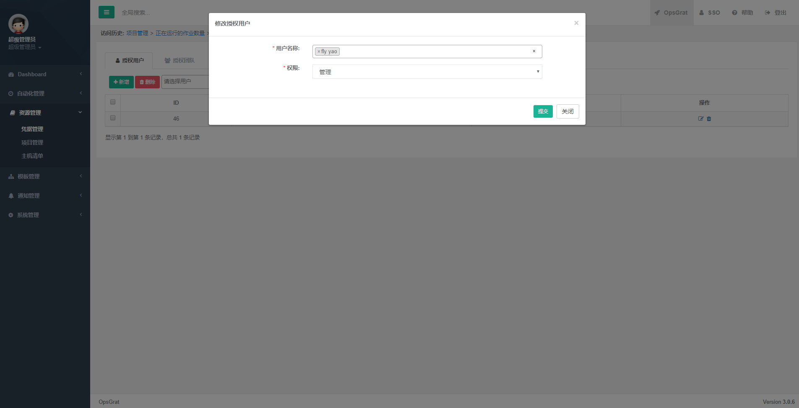

**1.6.5 权限管理（授权用户）删除**
--------------------

.. code-block:: vim

    点击操作栏下的“删除”按钮，可以删除该授权用户。

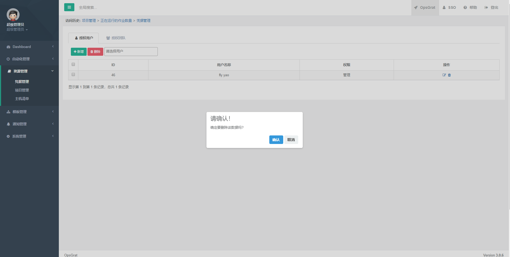


**1.6.6 权限管理（授权团队）**
--------------------

.. code-block:: vim

    点击上方页卡的“授权团队”按钮，可进入到授权团队界面。

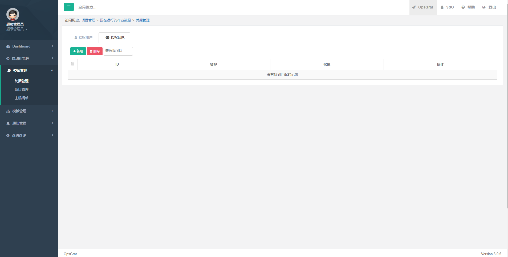

**1.6.7 权限管理（授权团队）查询**
--------------------

.. code-block:: vim

    点击搜索模态框，可以根据根据团队进行搜索查询。


**1.6.8 权限管理（授权团队）新增**
--------------------

.. code-block:: vim

    点击“新增”按钮，根据模态框新增相应得数据进行添加授权团队。

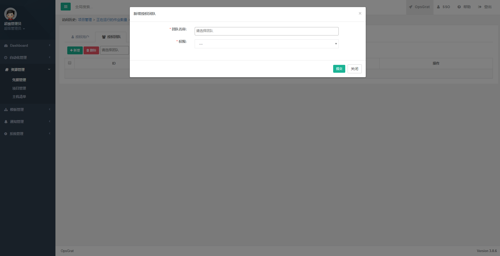

**1.6.9 权限管理（授权团队）修改**
--------------------

.. code-block:: vim

    点击操作栏下的“修改”按钮，根据模态框相应得数据进行修改凭据。


**1.6.10 权限管理（授权团队）删除**
--------------------

.. code-block:: vim

    点击操作栏下的“删除”按钮，可以删除该授权团队。

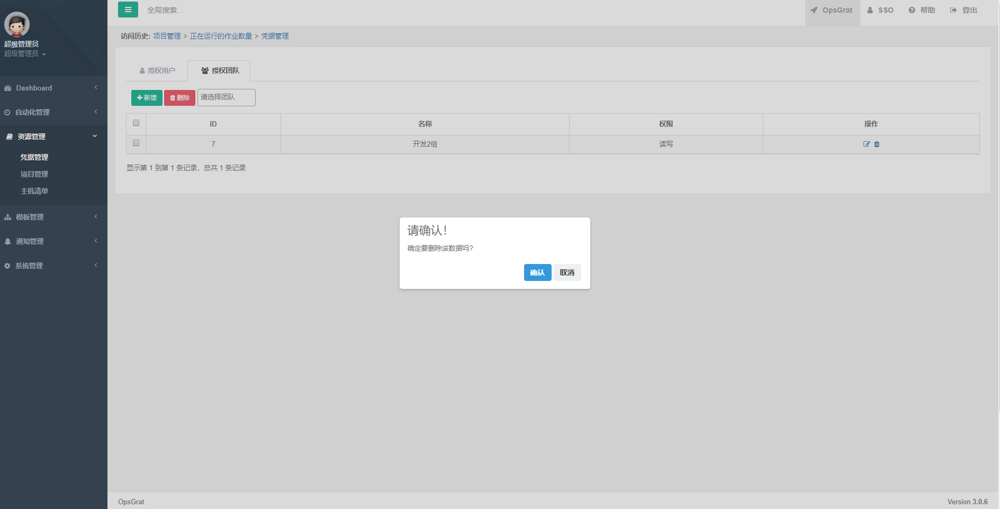


二、项目管理
````````````````````

**1.1 查看项目**
--------------------

.. code-block:: vim

    点击“资源管理”下的“项目管理”菜单，进入项目管理页面，可以在该页面查看所有添加的项目。
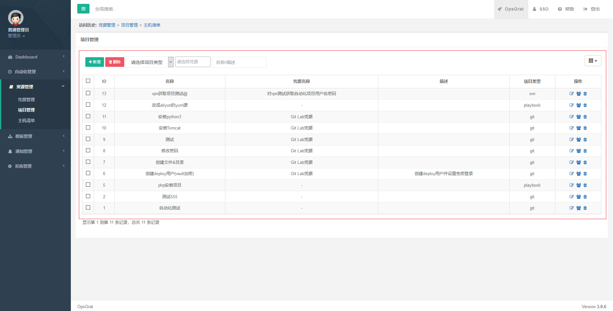

**1.2 查询**
--------------------

.. code-block:: vim

    点击搜索模态框，可以根据根据项目类型、凭据、名称、描述进行搜索查询，点击最右边的按钮，可以对相应得数据隐藏或者显示。

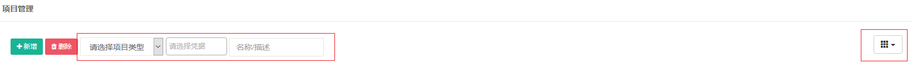

**1.3 添加项目**
--------------------

.. code-block:: vim

    点击“新增”按钮，根据模态框新增相应得数据进行添加项目。

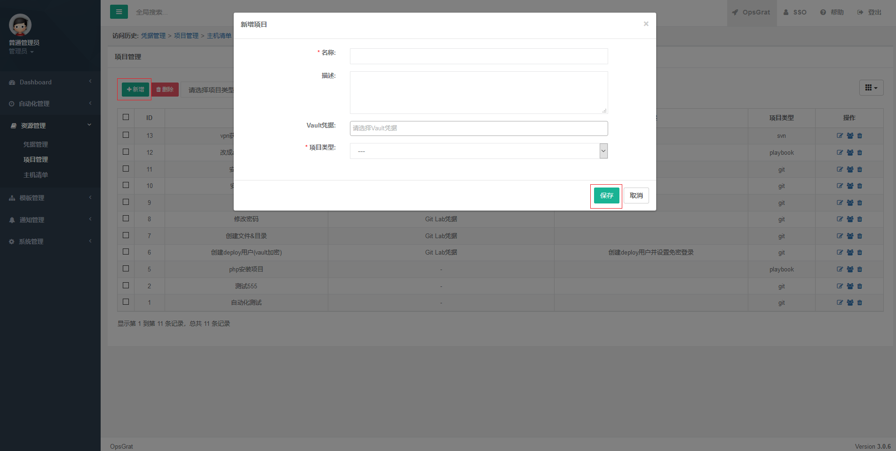

**1.4 修改项目**
--------------------

.. code-block:: vim

    点击操作栏下的“修改”按钮，根据模态框相应得数据进行修改项目。

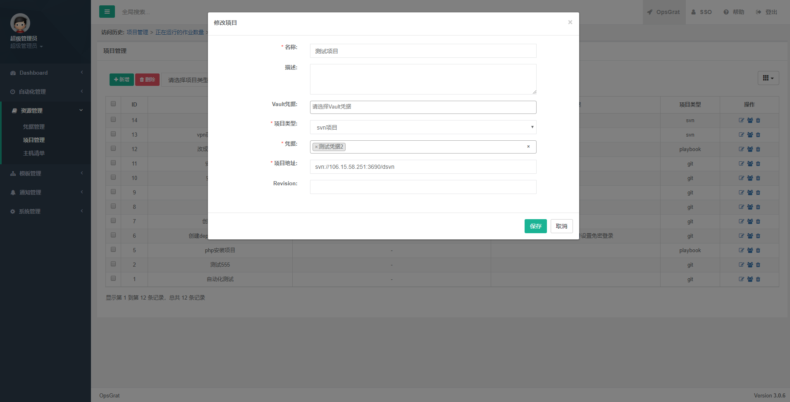

**1.5 删除项目**
--------------------

.. code-block:: vim

    点击操作栏下的“删除”按钮，可以删除该项目。

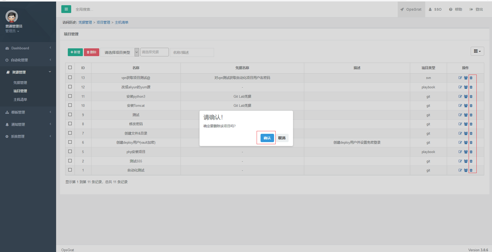

**1.6.1 权限管理（授权用户）**
--------------------

.. code-block:: vim

    点击操作栏下的“权限管理”按钮，可进入到授权用户界面。


**1.6.2 权限管理（授权用户）查询**
--------------------

.. code-block:: vim

    点击搜索模态框，可以根据根据凭据名称和用户名进行搜索查询。


**1.6.3 权限管理（授权用户）新增**
--------------------

.. code-block:: vim

    点击“新增”按钮，根据模态框新增相应得数据进行添加授权用户。


**1.6.4 权限管理（授权用户）修改**
--------------------

.. code-block:: vim

    点击操作栏下的“修改”按钮，根据模态框相应得数据进行修改凭据。


**1.6.5 权限管理（授权用户）删除**
--------------------

.. code-block:: vim

    点击操作栏下的“删除”按钮，可以删除该授权用户。


**1.6.6 权限管理（授权团队）**
--------------------

.. code-block:: vim

    点击上方页卡的“授权团队”按钮，可进入到授权团队界面。


**1.6.7 权限管理（授权团队）查询**
--------------------

.. code-block:: vim

    点击搜索模态框，可以根据根据团队进行搜索查询。


**1.6.8 权限管理（授权团队）新增**
--------------------

.. code-block:: vim

    点击“新增”按钮，根据模态框新增相应得数据进行添加授权团队。


**1.6.9 权限管理（授权团队）修改**
--------------------

.. code-block:: vim

    点击操作栏下的“修改”按钮，根据模态框相应得数据进行修改凭据。


**1.6.10 权限管理（授权团队）删除**
--------------------

.. code-block:: vim

    点击操作栏下的“删除”按钮，可以删除该授权团队。

