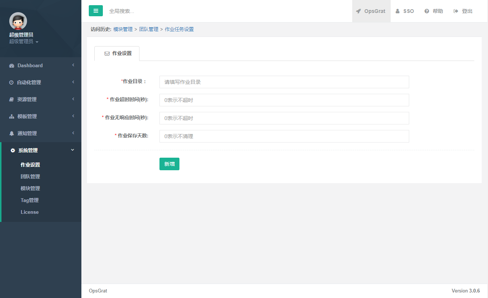
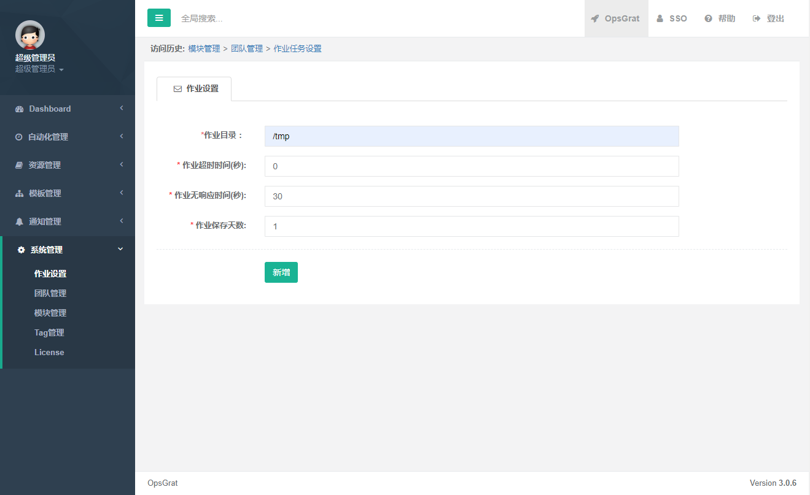
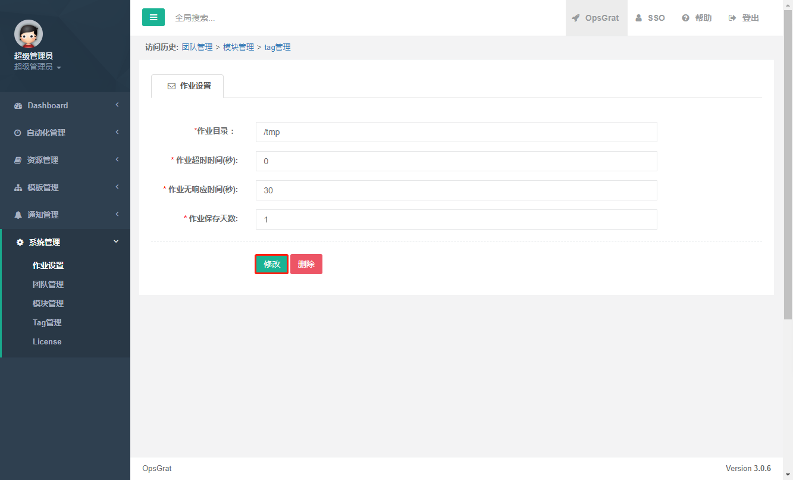
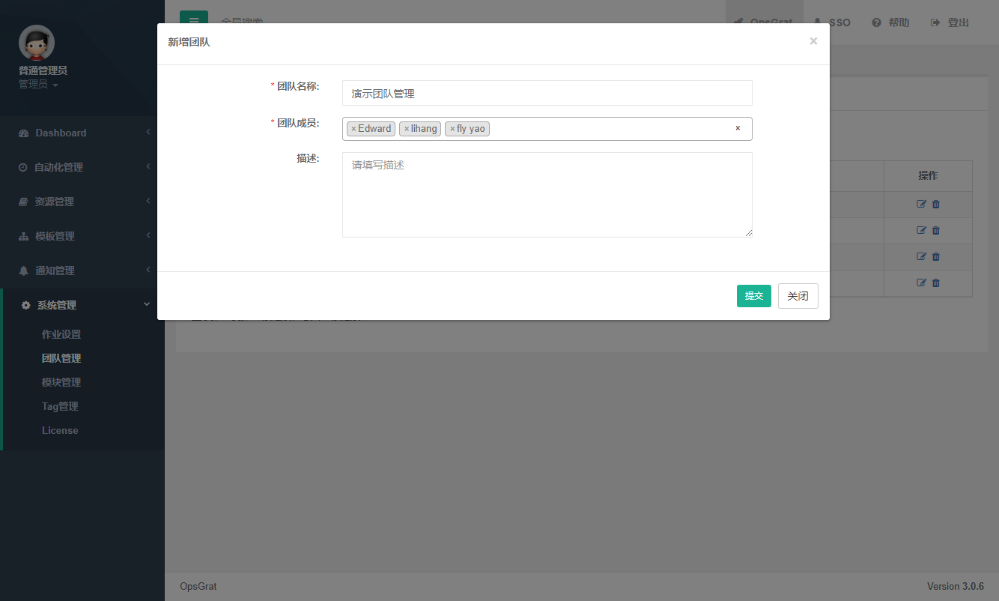
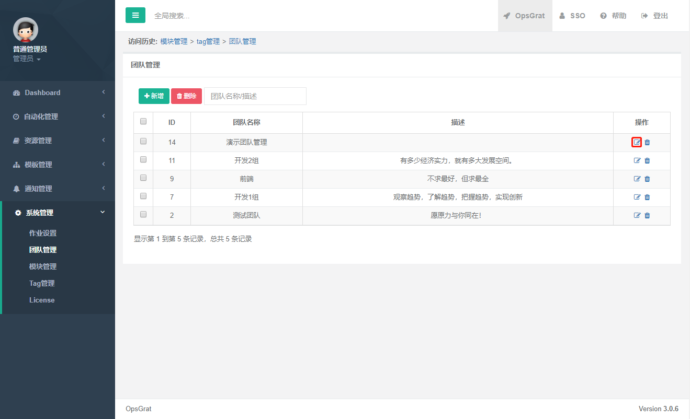
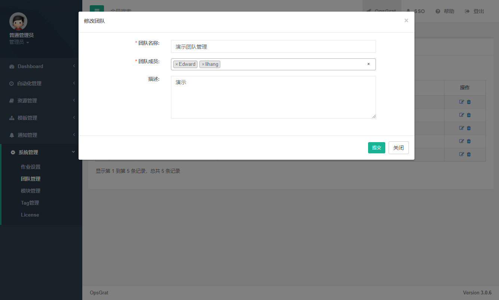
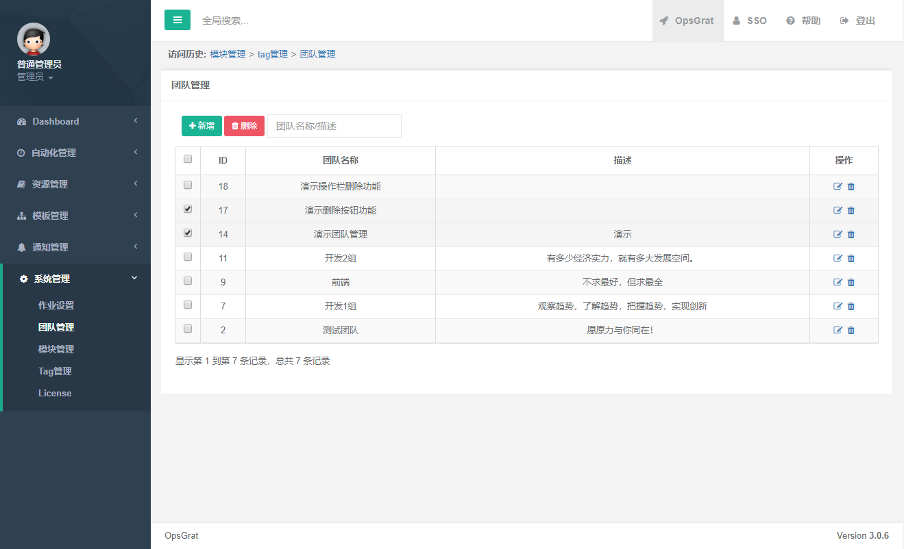
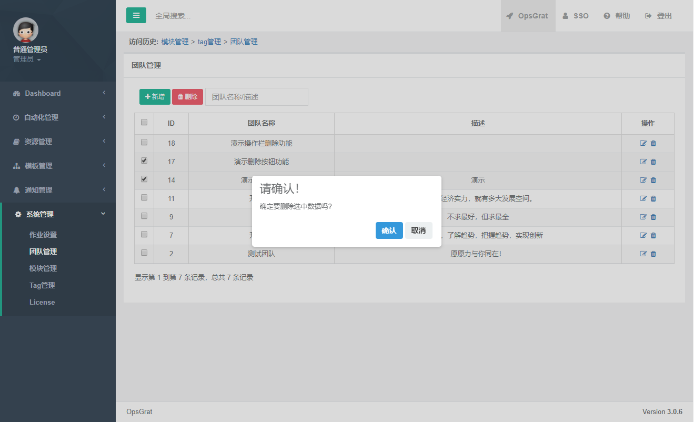
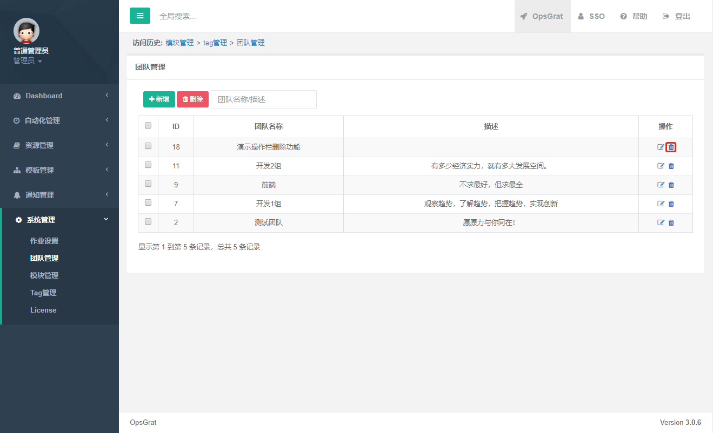
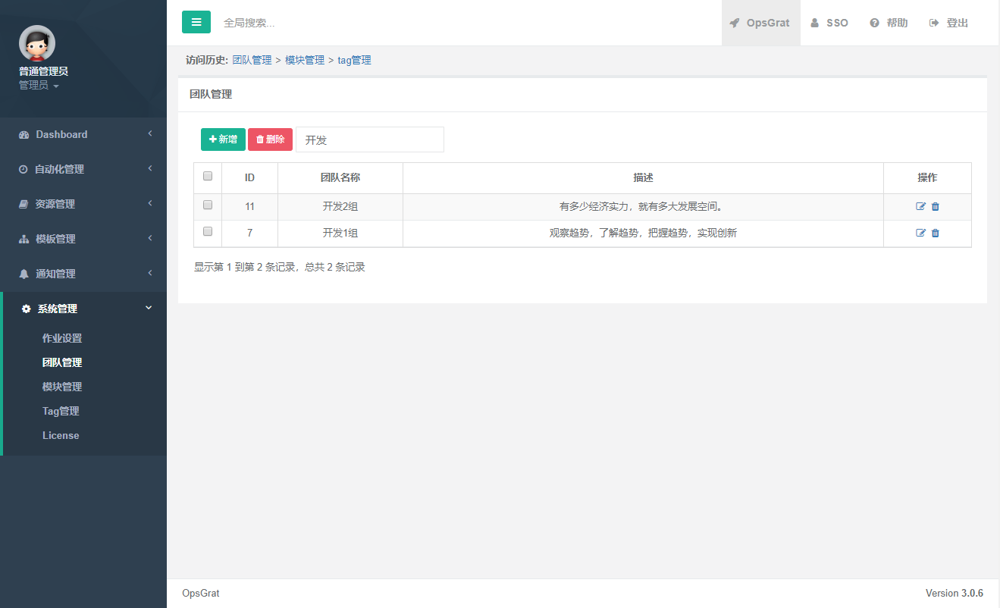

系统管理
============================

说明
````````````
- 对系统管理功能使用的说明

一、作业设置
````````````````````

::

    点击左侧菜单“系统管理”下的“作业设置”菜单，进入作业设置




::

    输入内容，点击“新增”按钮，保存配置的参数



::

    若需改变已保存的值，修改完成后，点击“修改”按钮，保存配置的参数
    “删除”按钮，清空保存的值




二、团队管理
````````````````````

** 1.新增 **
-----------------------------

::

    点击左侧菜单“系统管理”下的“团队管理”菜单

.. image:: ../_static/img/using/system/system/team.png

::

    点击“新增”按钮，新增团队




** 2.修改 **
-----------------------------

::

    点击操作栏下的“修改”按钮，进入修改界面



::

    修改完相应的内容后，点击提交



** 3.删除 **
-----------------------------

::

    批量删除：选择想要删除的团队，点击删除按钮



::

    会有提示询问是否删除



::

    单个删除：选择操作栏的删除图标，进行删除



** 4.搜索 **
-----------------------------

::

    搜索框输入要搜索的内容，会根据团队名称和描述进行搜索




三、模块管理
````````````````````
