系统管理
============================


一、作业设置
````````````````````

::

    点击左侧菜单“系统管理”下的“作业设置”菜单，进入作业设置

.. image:: ../_static/img/using/system/jobsettingsadd.png


::

    输入内容，点击“新增”按钮，保存配置的参数

.. image:: ../_static/img/using/system/jobsettings_add2.png

::

    若需改变已保存的值，修改完成后，点击“修改”按钮，保存配置的参数
    “删除”按钮，清空保存的值

.. image:: ../_static/img/using/system/jobsettings_bc.png


二、团队管理
````````````````````

1、新增
-----------------------------

::

    点击左侧菜单“系统管理”下的“团队管理”菜单

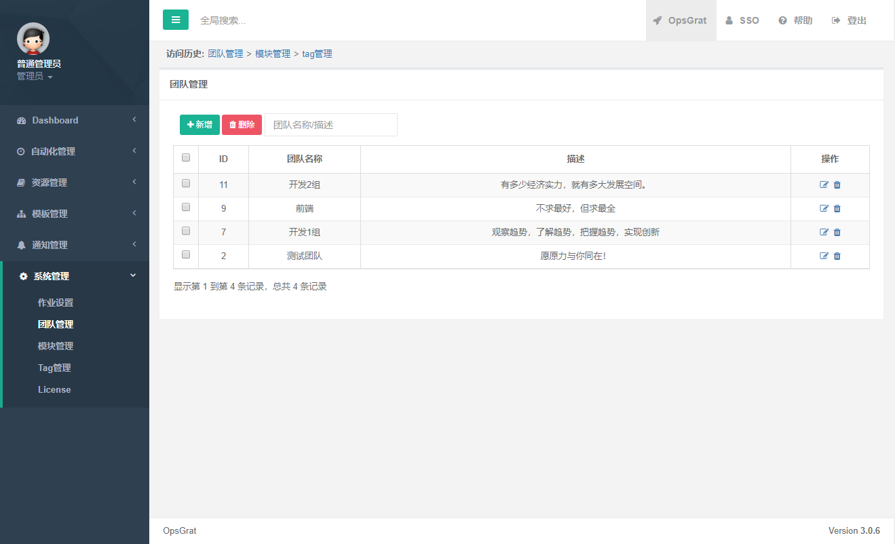

::

    点击“新增”按钮，新增团队

.. image:: ../_static/img/using/system/team_add.png


2、修改
-----------------------------

::

    点击操作栏下的“修改”按钮，进入修改界面

.. image:: ../_static/img/using/system/team_two.png

::

    修改完相应的内容后，点击提交

.. image:: ../_static/img/using/system/team_update.png

3、删除
-----------------------------

::

    批量删除：选择想要删除的团队，点击删除按钮

.. image:: ../_static/img/using/system/team_delete.png

::

    会有提示询问是否删除

.. image:: ../_static/img/using/system/team_dalete_ts.png

::

    单个删除：选择操作栏的删除图标，进行删除

.. image:: ../_static/img/using/system/team_delete2.png

4、搜索
-----------------------------

::

    搜索框输入要搜索的内容，会根据团队名称和描述进行搜索

.. image:: ../_static/img/using/system/team_sou1.png


三、模块管理
````````````````````


1、新增
-----------------------------

::

    点击左侧菜单“系统管理”下的“模块管理”菜单

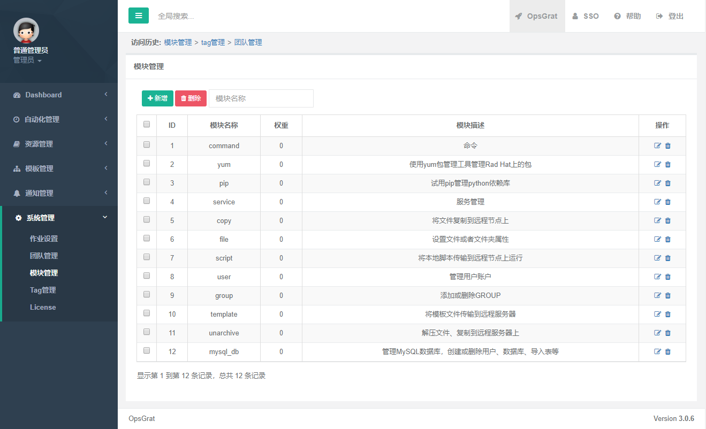

::

    点击“新增”按钮，新增模块

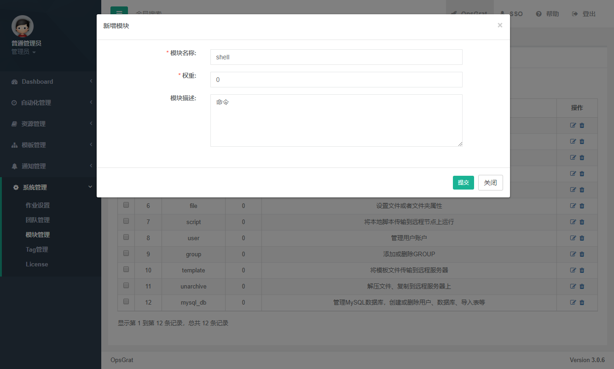


2、修改
-----------------------------

::

    点击操作栏下的“修改”按钮，进入修改界面

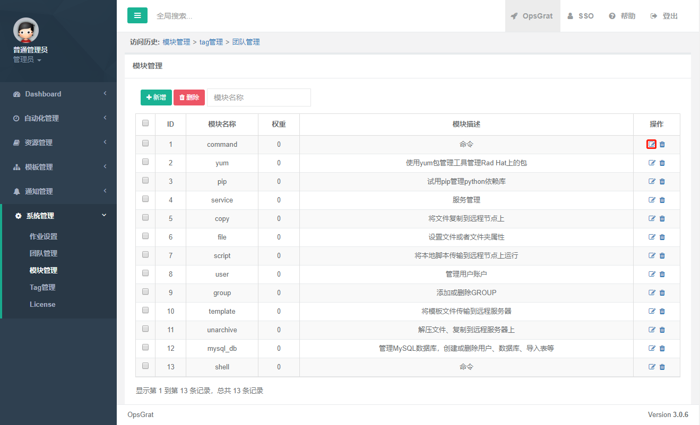

::

    如：修改权重，权重大的会排在前面

.. image:: ../_static/img/using/system/module_shell1.jpg

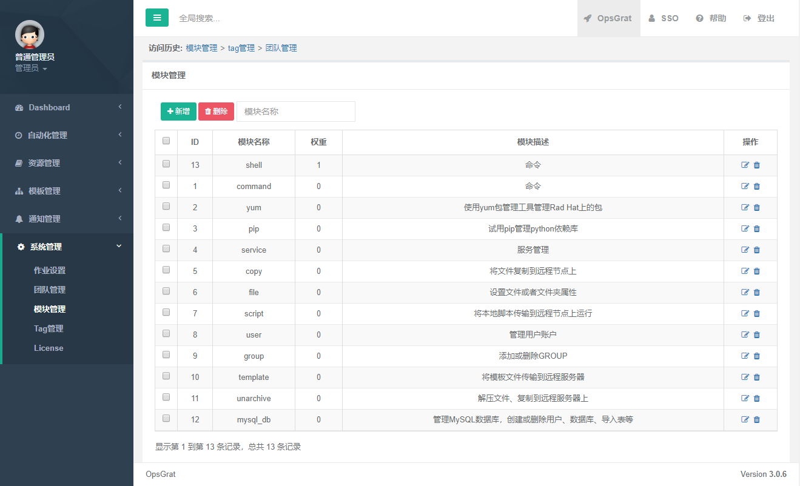

3、删除
-----------------------------

::

    批量删除：选择想要删除的模块，点击删除按钮


::

    单个删除：选择操作栏的删除图标，进行删除

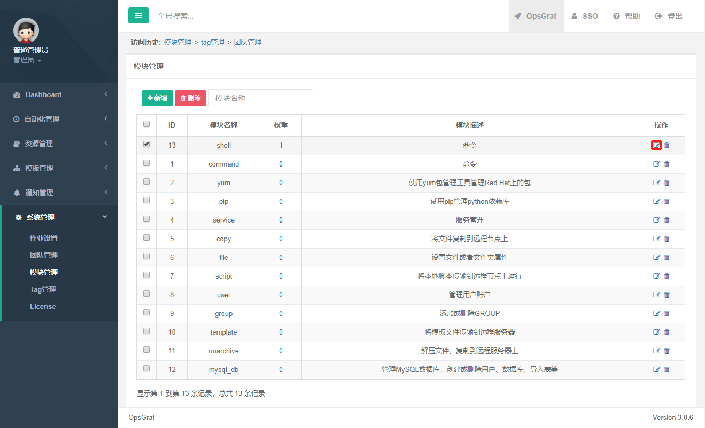

4、搜索
-----------------------------

::

    搜索框输入要搜索的内容，会根据“模块名称”和“模块描述”进行搜索

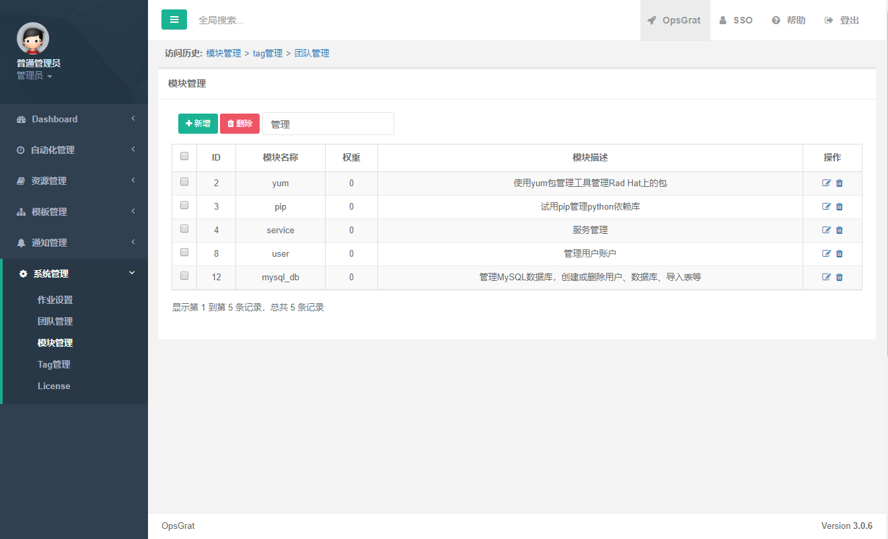

四、Tag管理
````````````````````


1、新增
-----------------------------

::

    点击左侧菜单“系统管理”下的“Tag管理”菜单

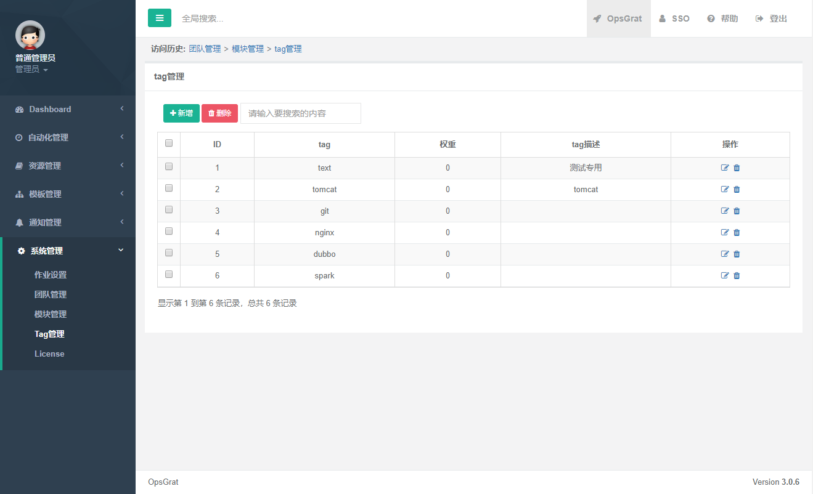

::

    点击“新增”按钮，新增模块

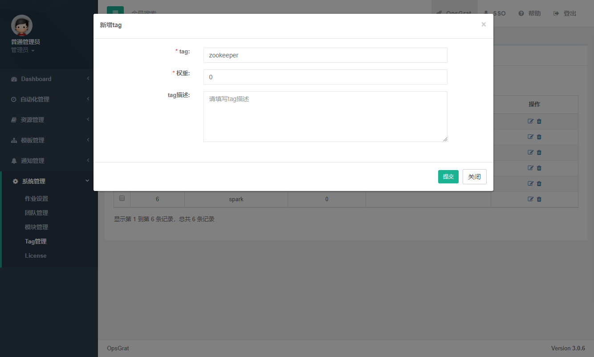


2、修改
-----------------------------

::

    点击操作栏下的“修改”按钮，进入修改界面

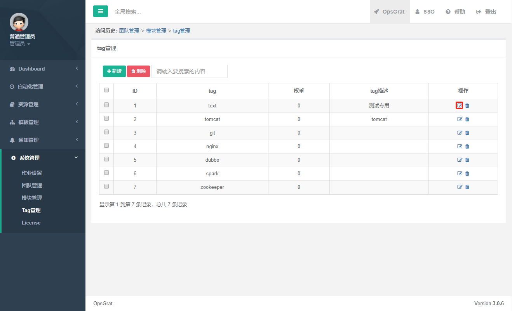

::

    如：修改权重，权重大的会排在前面

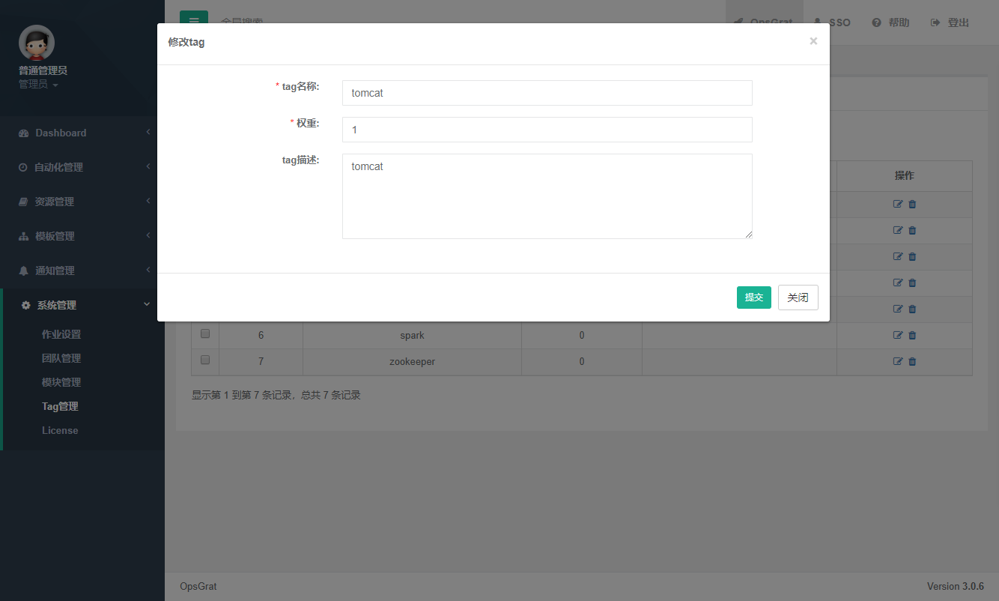


3、删除
-----------------------------

::

    批量删除：选择想要删除的模块，点击删除按钮

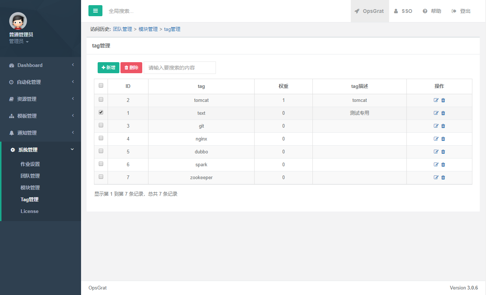


::

    单个删除：选择操作栏的删除图标，进行删除


4、搜索
-----------------------------

::

    搜索框输入要搜索的内容，会根据“tag”和“tag描述”进行搜索

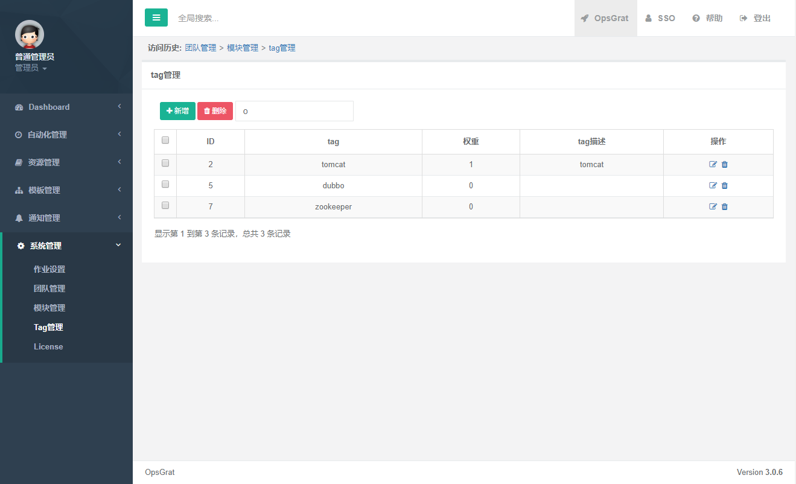

五、License
````````````````````


1、导入
-----------------------------

::

    点击左侧菜单“系统管理”下的“License”菜单

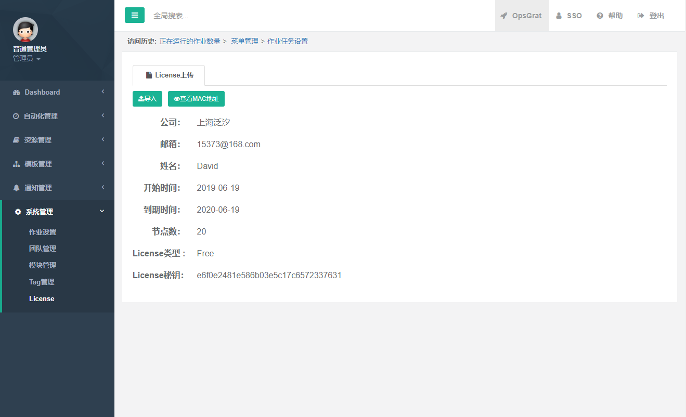

::

    点击“导入”按钮，导入申请时邮箱收到的License.txt文件，即可激活opsgrat功能

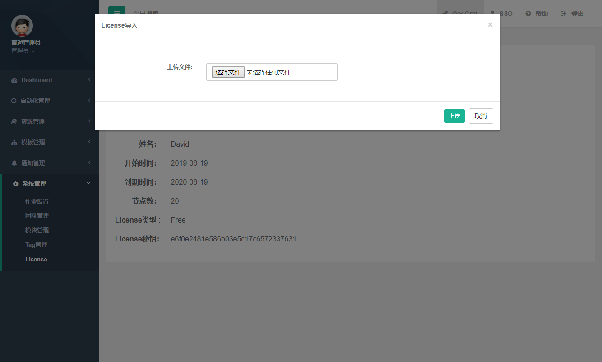


2、MAC地址
-----------------------------

::

    若申请时，MAC地址填写错误

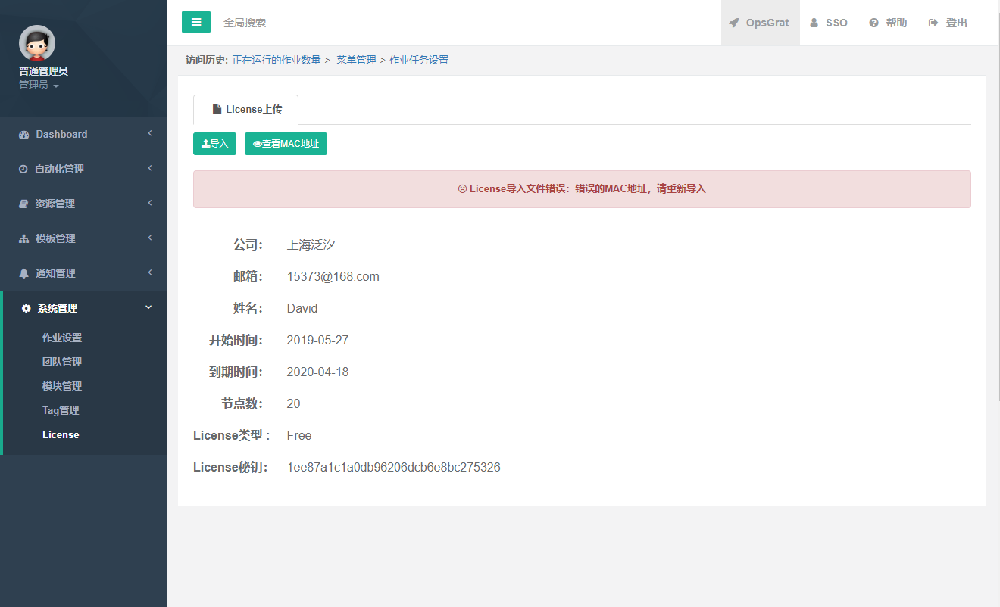

::

    可点击“查看MAC地址”，查看本机的MAC地址

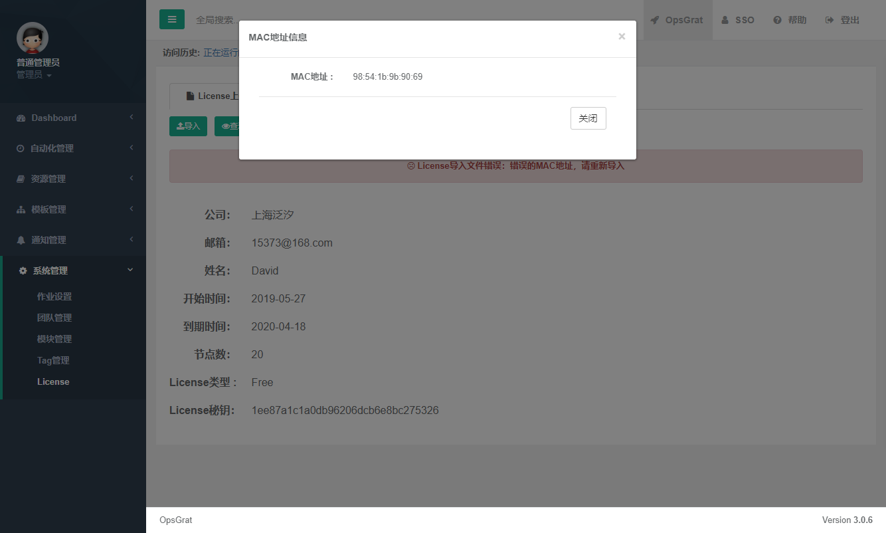

