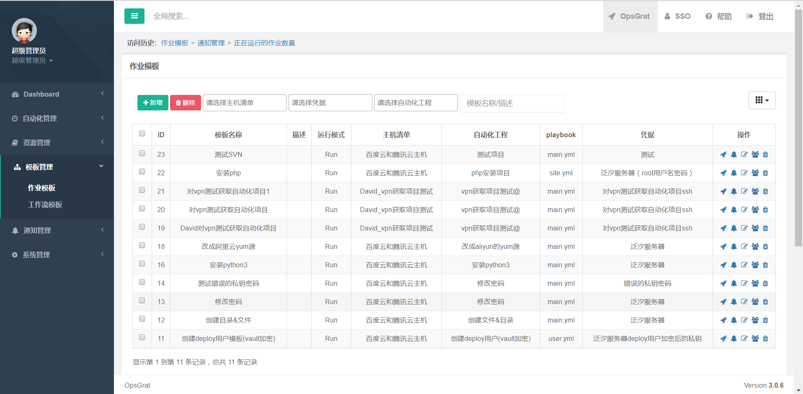
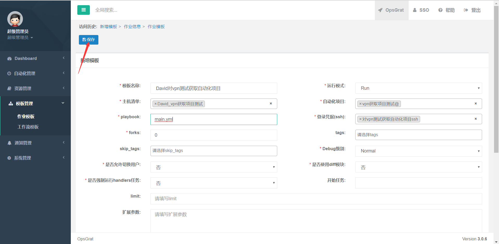
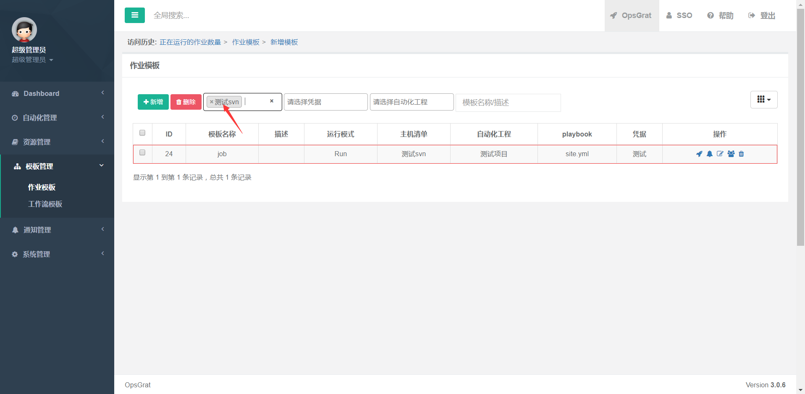
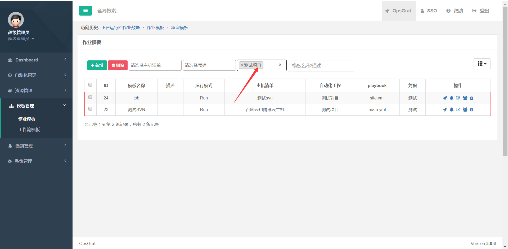
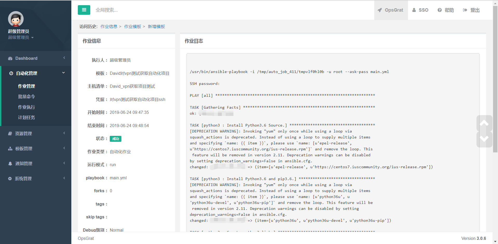
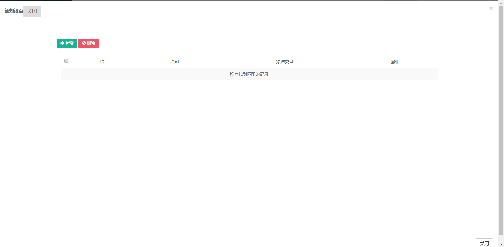
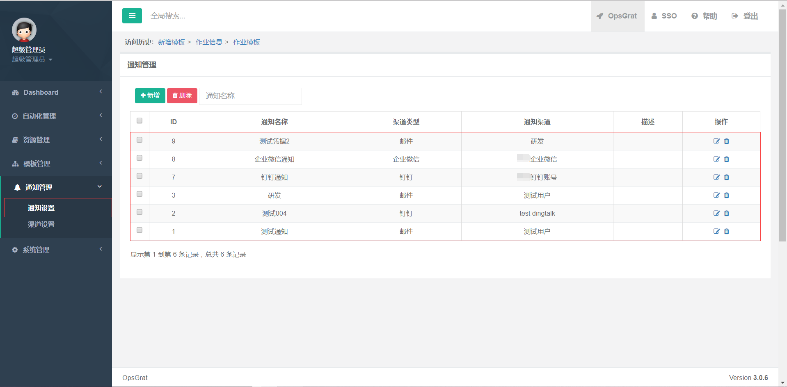
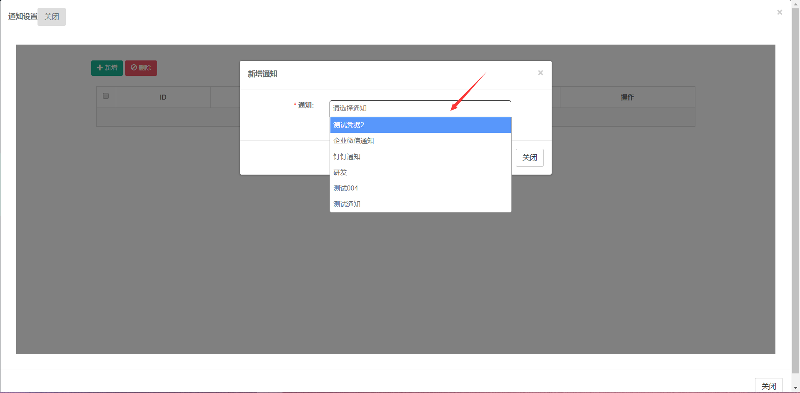
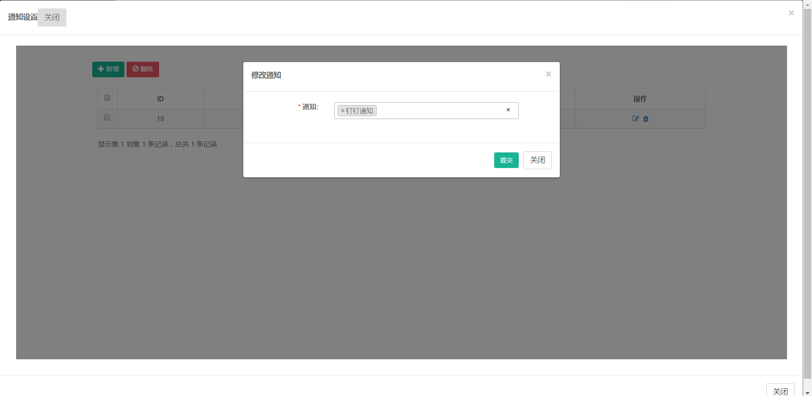
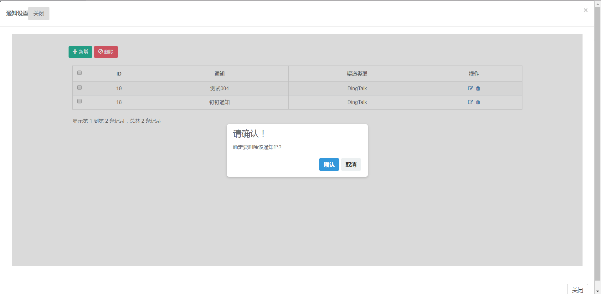

模板管理
=============================

批量命令执行
````````````

::

    点击左侧菜单“模板管理”下的“作业模板菜单”



::

    点击新增按钮，跳转到新增页面，并添加相应的数据(像此页面的主机清单、自动化管理、登录凭据(ssh)、tags等下拉框的值均来自于相应页面的新增数据后才可显示选择，前面章节以作相应的介绍，这里不再赘述)，点击保存



::

    点击保存后，跳转到作业模板页面、同时可以点击上方下拉框进行主机清单、凭据、自动化项目等数据查询并返回查询结果、返回结果分别如下图：



.. image:: ../_static/img/using/template/template_query_pingju.png



::

    点击操作框内的执行按钮，跳转到该作业模板的日志页面，显示作业信息和作业日志



::

    点击操作框内的通知按钮，跳转到该作业模板的通知设置页面



::

    点击新增按钮按钮，添加相应数据并提交保存(新增时的通知字段下拉框值来自于通知管理--通知设置，要提前新增数据才可显示)，具体步骤如下图：





::

    点击修改按钮，修改相应的数据，点击删除按钮，可以删除当前行数据、具体如下图：






.. image:: ../_static/img/using/template/template_delete_result.png


::

    返回作业模板页面点击


查看作业日志
````````````
